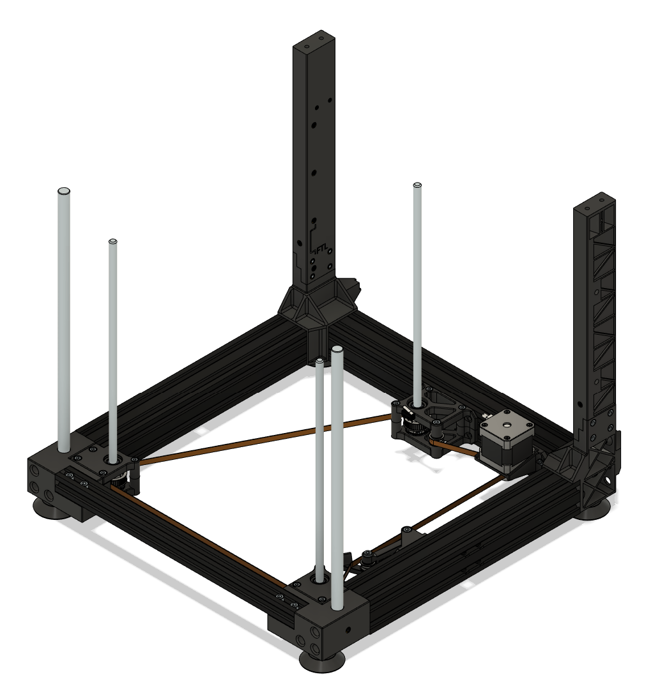
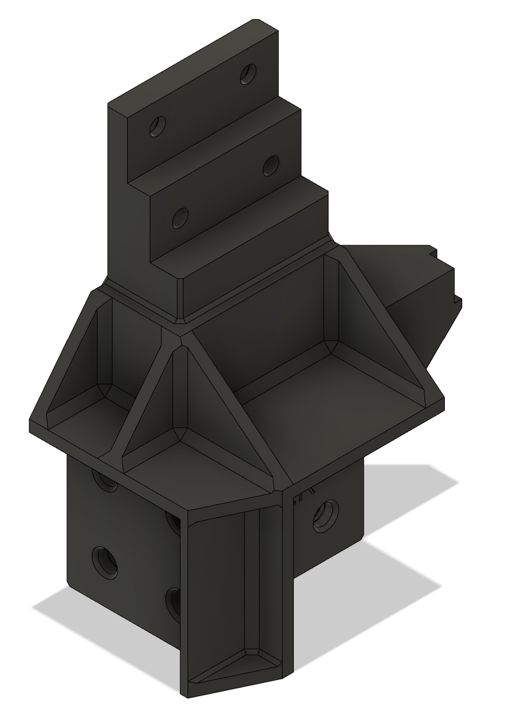
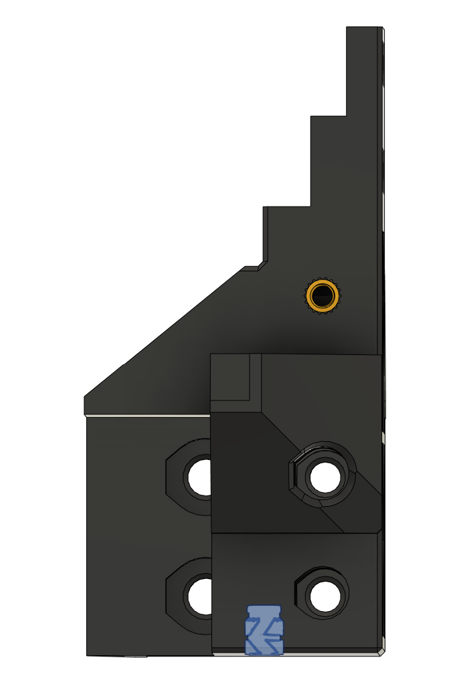
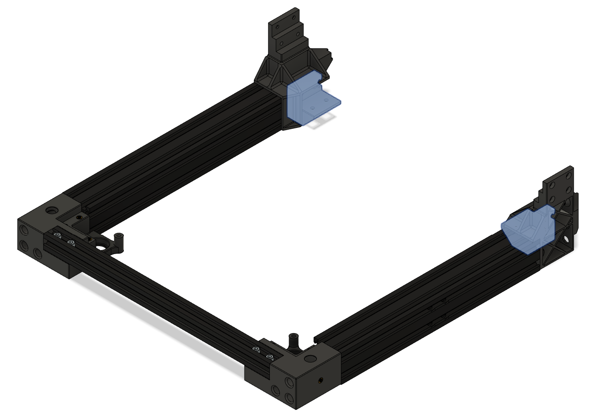
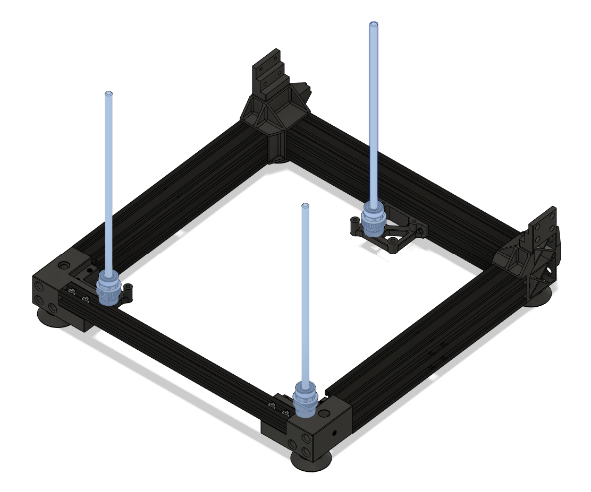
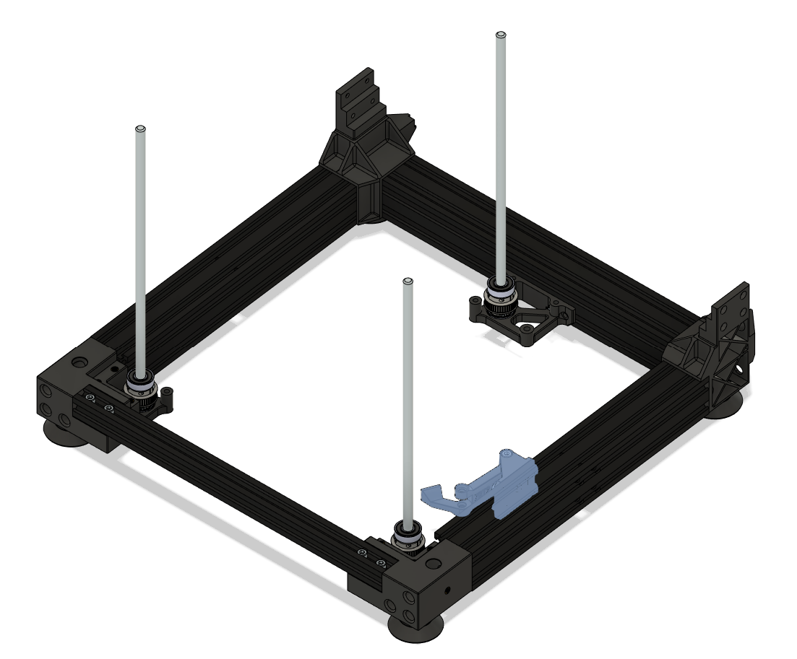
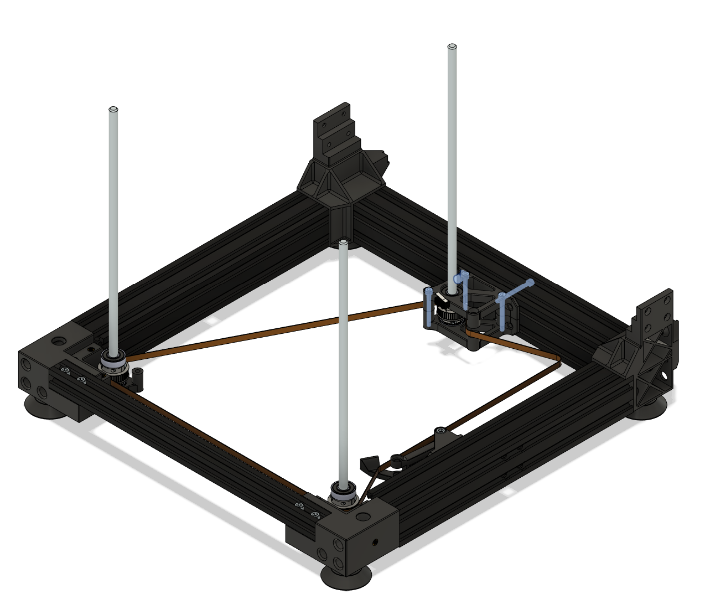
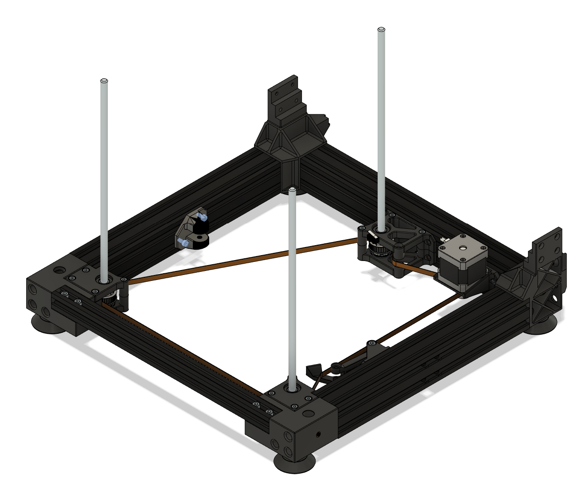
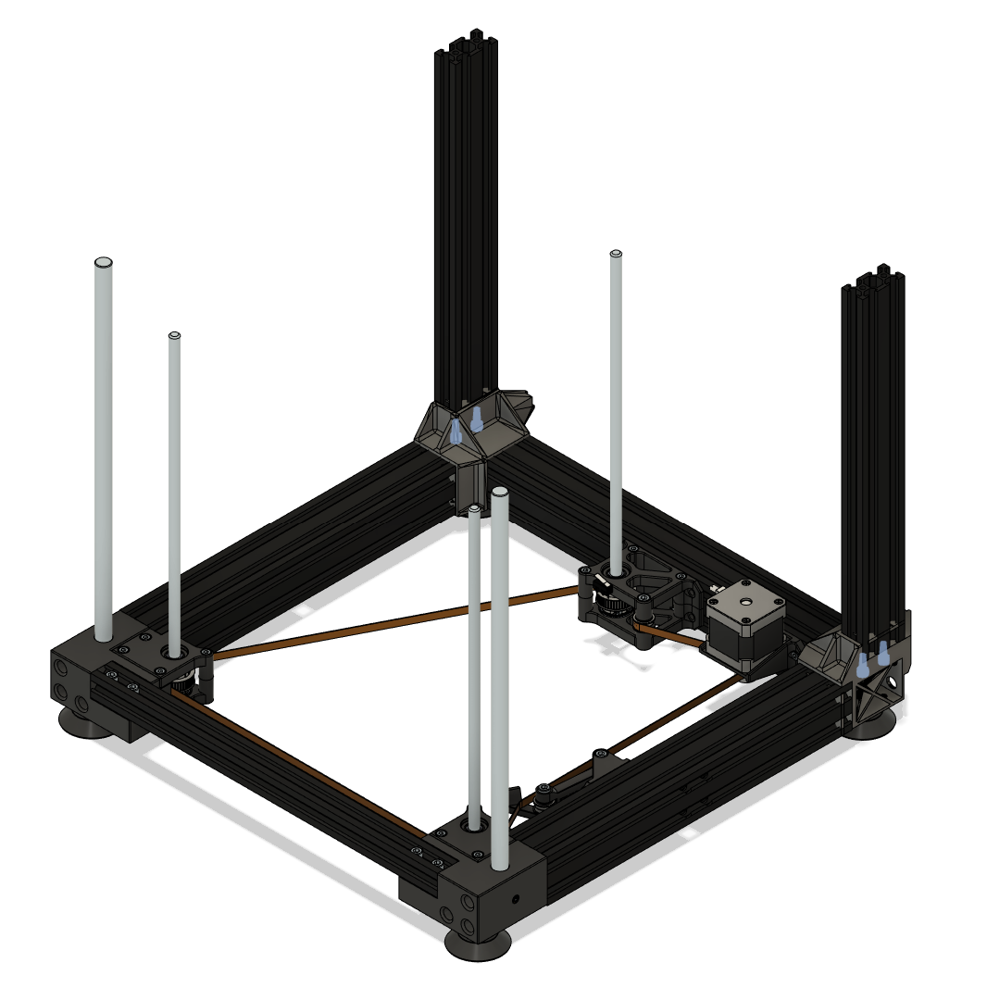

# Bottom

Bottom frame and Z lift. 

In the previous version of this guide, installing the rear frame ([G17](#g17---install-the-rear-frames)) was part of [Electronics/G6](../3.electronics/electronics.md#g6---attach-side-frame). It was moved here because there are 4 alternatives of rear frames, and installing the aluminium ones on the electronics enclosure without guidance would be challenging. If you are using alternative RF.A, it maybe better to attach the side frame to the electronics enclosure before attaching it to the bottom frame, as suggested before (during Electronics/G6). Here are the alternatives of rear frames:

- Alternative RF.A (default): printed version
- Alternative RF.B: 2x 350mm 2040 aluminium extrusion
- Alternative RF.C: 2x 300mm 2040 aluminium extrusion
- Alternative RF.D: 2x 310mm 2040 aluminium extrusion

There are also alternatives for the size of the belts:

- Alternative Z.S: short Z belt (1040mm)
- Alternative Z.L: long Z belt (longer than 1070mm)

And alternatives for the type of the source printer:

- Alternative E3.P: Ender 3 Pro
- Alternative E3.O: OG Ender 3

## Table of Contents 

- [BOM](#bom)
- [P - Printed Parts](#p---printed-parts)
- [H - Printed Parts with Heat Inserts](#h---printed-parts-with-heat-insertsmicroswitches)
- [G - Guide](#g---guide)

## BOM

#### General Parts

| Step | Part | Count | Type | Note |
| ---- | ---- | ----- | ---- | ---- |
| [H2](#h2---eng-blfa-and-eng-brfa), [G1](#g1---get-corners) | ENG-BLFA| 1 | Printed |
| [H2](#h2---eng-blfa-and-eng-brfa) | M4 heat insert standard | 6 | Hardware | For ENG-BLFA
| [H2](#h2---eng-blfa-and-eng-brfa) | M5 heat insert standard | 2 | Hardware | For ENG-BLFA
| [H2](#h2---eng-blfa-and-eng-brfa), [G1](#g1---get-corners) | ENG-BRFA| 1 | Printed |
| [H2](#h2---eng-blfa-and-eng-brfa) | M4 heat insert standard | 6 | Hardware | For ENG-BRFA
| [H2](#h2---eng-blfa-and-eng-brfa) | M5 heat insert standard | 2 | Hardware | For ENG-BRFA
| [G2](#g2---install-4040-base-frames-to-the-sides) | 4040 Base Frame | 2 | Ender 3
| [G2](#g2---install-4040-base-frames-to-the-sides) | M5x12 | 4 | Hardware | Connect ENG-BLR to 4040 Base Frame
| [G2](#g2---install-4040-base-frames-to-the-sides) | M5x12 | 4 | Hardware | Connect ENG-BRR to 4040 Base Frame
| [G2](#g2---install-4040-base-frames-to-the-sides) | M5x12 | 3 | Hardware | Connect ENG-BLFA to 4040 Base Frame
| [G2](#g2---install-4040-base-frames-to-the-sides) | M5x12 | 3 | Hardware | Connect ENG-BRFA to 4040 Base Frame
| [G3](#g3---install-2020-top-cross-frame-to-the-front) | 2020 Top Cross Frame | 1 | Ender 3
| [G3](#g3---install-2020-top-cross-frame-to-the-front) | M5x25 | 4 | Hardware | Connect ENG-BLFA and ENG-BRFA to 2020 Top Cross Frame
| [G5](#g5---install-feet) | M4x12 | 4 | Hardware | Feet
| [G5](#g5---install-feet) | M4 washers | 4 | Hardware | Feet
| [G5](#g5---install-feet) | Rubber feet | 4 | Electronics | Feet
| [H4](#h4---eng-bzb), [G6](#g6---attach-eng-bzb) | ENG-BZB | 1 | Printed
| [H4](#h4---eng-bzb) | M5 heat insert standard | 1 | Hardware | For ENG-BZB
| [H4](#h4---eng-bzb) | M4 heat insert standard | 3 | Hardware | For ENG-BZB
| [H4](#h4---eng-bzb) | M4 heat insert short | 1 | Hardware | For ENG-BZB
| [P3](#p3---eng-bzp), [G7](#g7---prepare-leadscrews) | ENG-BZP | 3 | Printed | Or 42T Pulley
| [G7](#g7---prepare-leadscrews) | T8/8 300mm leadscrew | 3 | Motion 
| [G7](#g7---prepare-leadscrews) | 608 2RS bearing | 6 | Motion | Sandwich of ENG-BZP
| [G7](#g7---prepare-leadscrews) | M3x10 | 12 | Hardware | Sandwich of ENG-BZP
| [H5](#h5---eng-zbt1), [G8.1](#g81---attach-tensioner-mount-to-4040) | ENG-ZBT1 | 1 | Printed
| [H5](#h5---eng-zbt1) | M5 heat insert short | 1 | Hardware | For ENG-ZBT1 
| [G8.1](#g81---attach-tensioner-mount-to-4040) | M4x8 | 4 | Hardware | Connect ENG-ZBT1 to 4040
| [G8.1](#g81---attach-tensioner-mount-to-4040) | M4 T-Nut | 4 | Hardware | Connect ENG-ZBT1 to 4040
| [G8.1](#g81---attach-tensioner-mount-to-4040) | M3x5 | 1 | Hardware | Hold spring on ENG-ZBT1
| [H6](#h6---eng-zbt2), [G8.2](#g82---mount-tensioner-arm) | ENG-ZBT2 | 1 | Printed
| [H6](#h6---eng-zbt2) | M5 heat insert short | 1 | Hardware | For ENG-ZBT2
| [G8.2](#g82---mount-tensioner-arm) | M3x5 | 1 | Hardware | Hold spring on ENG-ZBT2
| [G8.2](#g82---mount-tensioner-arm) | Spring | 1 | Ender 3 | Spring that comes with the bed
| [G8.2](#g82---mount-tensioner-arm) | M5x35 | 1 | Hardware | Connect ENG-ZBT2 to ENG-ZBT1
| [G10](#g10---close-rear-z-leadscrew-with-eng-bza) | M4x35 | 3 | Hardware | Connect ENG-BZA to ENG-BZB
| [P4](#p4---eng-blfb-and-eng-brfb), [G11](#g11---close-front-z-leadscrews-with-eng-blfb-and-eng-brfb) |  ENG-BLFB | 1 | Printed
| [P4](#p4---eng-blfb-and-eng-brfb), [G11](#g11---close-front-z-leadscrews-with-eng-blfb-and-eng-brfb) | ENG-BRFB | 1 | Printed
| [G11](#g11---close-front-z-leadscrews-with-eng-blfb-and-eng-brfb) | M4x12 | 3 | Hardware | Connect ENG-BLFB to ENG-BLFA
| [G11](#g11---close-front-z-leadscrews-with-eng-blfb-and-eng-brfb) | M4x35 | 1 | Hardware | Connect ENG-BLFB to ENG-BLFA
| [G11](#g11---close-front-z-leadscrews-with-eng-blfb-and-eng-brfb) | M4x12 | 3 | Hardware | Connect ENG-BRFB to ENG-BRFA
| [G11](#g11---close-front-z-leadscrews-with-eng-blfb-and-eng-brfb) | M4x35 | 1 | Hardware | Connect ENG-BRFB to ENG-BRFA
| [P2](#p2---eng-bzm), [G12](#g12zl---install-z-motor-mount) | ENG-BZM | 1 | Printed | For belts longer than 1070mm – with long belts use also ENG-BZI (optional)
| [G13](#g13---install-z-motor) | Motor Nema 17 | 1 | Ender 3 |
| [G13](#g13---install-z-motor) | M3x6 | 4 | Hardware | Connect Nema 17 to ENG-BZM
| [G15](#g15---add-two-bearing-systems-to-z-belt) | M5 Washer | 4 | Hardware | For Z Belt bearings
| [G15](#g15---add-two-bearing-systems-to-z-belt) | F695 Bearing | 4 | Motion | For Z Belt bearings
| [G15](#g15---add-two-bearing-systems-to-z-belt) | M5x35 | 1 | Hardware | Connect bearing to ENG-BZA/ENG-BZB
| [G15](#g15---add-two-bearing-systems-to-z-belt) | M5x20 | 1 | Hardware | Connect bearing to ENG-ZBT1/ENG-ZBT2
| [G16](#g16---add-linear-rods) | Z linear rods 12x350mm | 2 | Motion
| [G16](#g16---add-linear-rods) | M4x8 grubscrew | 2 | Hardware

#### RF.A - Specific parts for the Printed version of rear frames

| Step | Part | Count | Type | Note |
| ---- | ---- | ----- | ---- | ---- |
| [H1:RF.A](#h1rfa---eng-blr-and-eng-blr), [G1](#g1---get-corners) | ENG-BLR | 1 | Printed |
| [H1:RF.A](#h1rfa---eng-blr-and-eng-blr) | M4 heat insert standard | 2 | Hardware | For ENG-BLR
| [H1:RF.A](#h1rfa---eng-blr-and-eng-blr), [G1](#g1---get-corners) | ENG-BRR| 1 | Printed |
| [H1:RF.A](#h1rfa---eng-blr-and-eng-blr) | M4 heat insert standard | 2 | Hardware | For ENG-BRR
| [H8:RF.A](#h8rfa---eng-ftl-and-eng-ftr), [G17:RF.A](#g17rfa---printed-version) | ENG-FTL | 1 | Printed
| [H8:RF.A](#h8rfa---eng-ftl-and-eng-ftr) | M4 heat insert standard | 11 | Hardware | For ENG-FTL
| [H8:RF.A](#h8rfa---eng-ftl-and-eng-ftr) | M3 heat insert standard | 2 | Hardware | For ENG-FTL
| [H8:RF.A](#h8rfa---eng-ftl-and-eng-ftr), [G17:RF.A](#g17rfa---printed-version) | ENG-FTR | 1 | Printed
| [H8:RF.A](#h8rfa---eng-ftl-and-eng-ftr) | M4 heat insert standard | 11 | Hardware | For ENG-FTR
| [H8:RF.A](#h8rfa---eng-ftl-and-eng-ftr) | M3 heat insert standard | 2 | Hardware | For ENG-FTR
| [G17:RF.A](#g17rfa---printed-version) | M4x16 | 4 | Hardware | Connect ENG-FTL to ENG-BRL
| [G17:RF.A](#g17rfa---printed-version) | M4x16 | 4 | Hardware | Connect ENG-FTR to ENG-BRR

#### RF.B - Specific parts for the 350mm 2040 aluminium extrusion version of rear frames

| Step | Part | Count | Type | Note |
| ---- | ---- | ----- | ---- | ---- |
| [H1:RF.B](#h1rfb---eng-blr_2040_350-and-eng-brr_2040_350), [G1](#g1---get-corners) | ENG-BLR_2040_350 | 1 | Printed |
| [H1:RF.B](#h1rfb---eng-blr_2040_350-and-eng-brr_2040_350), [G1](#g1---get-corners) | ENG-BRR_2040_350| 1 | Printed |
| [G5](#g5---install-feet) | M4 T-nut | 2 | Hardware | Connect rear feet to base frames
| [G17](#g17rfb---350mm-2040-aluminium-extrusion-version-of-rear-frames) | 350mm 2040 aluminium extrusion | 2 | Hardware | Bought separately - it is not part of the Ender 3
| [G17](#g17rfb---350mm-2040-aluminium-extrusion-version-of-rear-frames) | M4x8 | 8 | Hardware | Connect 2040 to Bottom
| [G17](#g17rfb---350mm-2040-aluminium-extrusion-version-of-rear-frames) | M4 T-nut | 8 | Hardware | Connect 2040 to Bottom

#### RF.C - Specific parts for the 300mm 2040 aluminium extrusion version of rear frames

| Step | Part | Count | Type | Note |
| ---- | ---- | ----- | ---- | ---- |
| [H1:RF.C](#h1rfc---eng-blr_2040_300-and-eng-brr_2040_300), [G1](#g1---get-corners) | ENG-BLR_2040_300 | 1 | Printed |
| [H1:RF.C](#h1rfc---eng-blr_2040_300-and-eng-brr_2040_300), [G1](#g1---get-corners) | ENG-BRR_2040_300| 1 | Printed |
| [G17](#g17rfb---350mm-2040-aluminium-extrusion-version-of-rear-frames) | 300mm 2040 aluminium extrusion | 2 | Hardware | Bought separately - it is not part of the Ender 3
| [G17](#g17rfb---350mm-2040-aluminium-extrusion-version-of-rear-frames) | M5x12 | 4 | Hardware | Connect 2040 to Bottom

#### RF.D - Specific parts for the 310mm 2040 aluminium extrusion version of rear frames

| Step | Part | Count | Type | Note |
| ---- | ---- | ----- | ---- | ---- |
| [H1:RF.D](#h1rfd---eng-blr_2040_310-and-eng-brr_2040_310), [G1](#g1---get-corners) | ENG-BLR_2040_310 | 1 | Printed |
| [H1:RF.D](#h1rfd---eng-blr_2040_310-and-eng-brr_2040_310), [G1](#g1---get-corners) | ENG-BRR_2040_310 | 1 | Printed |
| [G17](#g17rfb---350mm-2040-aluminium-extrusion-version-of-rear-frames) | 310mm 2040 aluminium extrusion | 2 | Hardware | Bought separately - it is not part of the Ender 3
| [G17](#g17rfb---350mm-2040-aluminium-extrusion-version-of-rear-frames) | M5x12 | 4 | Hardware | Connect 2040 to Bottom

#### Z.S - Specific parts for short Z belt (1040mm)

| Step | Part | Count | Type | Note |
| ---- | ---- | ----- | ---- | ---- |
| [G9](#g9---insert-the-closed-loop-gt2-belt) | GT2 belt 6mm 1040 mm | 1 | Motion | Closed loop belt
| [H7:Z.S](#h7zs---eng-bza_1040), [G10](#g10---close-rear-z-leadscrew-with-eng-bza) | ENG-BZA_1040 | 1 | Printed
| [H7:Z.S](#h7zs---eng-bza_1040) | M4 heat insert short | 1 | Hardware | For ENG-BZA_1040

#### Z.L - Specific parts for long Z belt (>= 1070mm)

| Step | Part | Count | Type | Note |
| ---- | ---- | ----- | ---- | ---- |
| [G9](#g9---insert-the-closed-loop-gt2-belt) | GT2 belt 6mm >= 1070mm | 1 | Motion | Closed loop belt
| [H7:Z.L](#h7zl---eng-bza), [G10](#g10---close-rear-z-leadscrew-with-eng-bza) | ENG-BZA | 1 | Printed
| [H7:Z.L](#h7zl---eng-bza) | M4 heat insert short | 1 | Hardware | For ENG-BZA
| [G12:Z.L](#g12zl---install-z-motor-mount) | M4x8 | 2 | Hardware | Connect ENG-BZM to 2040/4040
| [G12:Z.L](#g12zl---install-z-motor-mount) | M4 T-nut | 2 | Hardware | Connect ENG-BZM to 2040/4040
| [P5:Z.L](#p5zl---eng-zbi), [G14.Z.L](#g14zl---install-z-belt-idler-eng-zbi) | ENG-ZBI | 1 | Printed | For longer belts – for example 1140 mm
| [G14.Z.L](#g14zl---install-z-belt-idler-eng-zbi) | M4x8 | 2 | Hardware | Connect ENG-ZBI to Frame, For longer belts – for example 1140 mm
| [G14.Z.L](#g14zl---install-z-belt-idler-eng-zbi) | M4 T-nut | 2 | Hardware | Connect ENG-ZBI to Frame, For longer belts – for example 1140 mm
| [G15](#g15---add-two-bearing-systems-to-z-belt) | M5 Washer | 2 | Hardware | For longer belts – for example 1140 mm
| [G15](#g15---add-two-bearing-systems-to-z-belt) | F695 Bearing | 2 | Motion | For longer belts – for example 1140 mm
| [G15](#g15---add-two-bearing-systems-to-z-belt) | M5x35 | 1 | Hardware | Connect bearing to ENG-ZBI, For longer belts – for example 1140 mm

#### E3.P - Specific parts for Ender 3 Pro

| Step | Part | Count | Type | Note |
| ---- | ---- | ----- | ---- | ---- |
| [G4A:E3.P](#g4ae3p---ender-3-pro) | 4040 Bed Frame | 1 | Ender 3 Pro
| [G4A:E3.P](#g4ae3p---ender-3-pro) | M5x12 | 8 | Hardware | Connect ENG-BLR and ENG-BRR to 4040
| [G6A](#g6a---ender-3-pro) | M4x40 | 1 | Hardware | Connect ENG-BZB to 4040
| [G6A](#g6a---ender-3-pro) | M4x8 | 1 | Hardware | Connect ENG-BZB to 4040
| [G6A](#g6a---ender-3-pro) | M4 T-nut | 1 | Hardware | Connect ENG-BZB to 4040
| [G10](#g10---close-rear-z-leadscrew-with-eng-bza) | M4x8 | 2* | Hardware | Connect ENG-BZA to Rear frame
| [G10](#g10---close-rear-z-leadscrew-with-eng-bza) | M4 T-nut | 2* | Hardware | Connect ENG-BZA to Rear frame
| [G10](#g10---close-rear-z-leadscrew-with-eng-bza) | M4x40 | 1 | Hardware | Connect ENG-BZA to Rear frame

\* 1 if you are using a longer Z-belt (Z.L)

#### E3.O - Specific parts for OG Ender 3

| Step | Part | Count | Type | Note |
| ---- | ---- | ----- | ---- | ---- |
| [H3:E3.O](#h3e3o---eng-blre3-and-eng-brre3), [G4B:E3.O.1](#g4be3o1---install-eng-blre3-and-eng-brre3) | ENG-BLRE3 | 1 | Printed |
| [H3:E3.O](#h3e3o---eng-blre3-and-eng-brre3) | M5 heat insert standard | 2 | Hardware | For ENG-BLRE3
| [H3:E3.O](#h3e3o---eng-blre3-and-eng-brre3), [G4B:E3.O.1](#g4be3o1---install-eng-blre3-and-eng-brre3) | ENG-BRRE3 | 1 | Printed |
| [H3:E3.O](#h3e3o---eng-blre3-and-eng-brre3) | M5 heat insert standard | 2 | Hardware | For ENG-BRRE3
| [G4B:E3.O.2](#g4be3o2---install-the-2040-aluminum-extrusion) | 2040 Bed Frame | 1 | OG Ender 3
| [G4B:E3.O.2](#g4be3o2---install-the-2040-aluminum-extrusion) | M5x12 | 4 | Hardware | Connect ENG-BLRE3 and ENG-BRRE3 to ENG-BRR and ENG-BLR
| [G4B:E3.O.2](#g4be3o2---install-the-2040-aluminum-extrusion) | M5x25 | 4 | Hardware | Connect ENG-BLRE3, ENG-BRRE3, ENG-BR R, and ENG-BLR to 2040
| [G4B:E3.O.2](#g4be3o2---install-the-2040-aluminum-extrusion) | M4x8 | 4 | Hardware | Connect ENG-BLRE3 and ENG-BRRE3 to 2040
| [G4B:E3.O.2](#g4be3o2---install-the-2040-aluminum-extrusion) | M4 T-nut | 4 | Hardware | Connect ENG-BLRE3 and ENG-BRRE3 to 2040
| [P1](#p1e3o---printed-part-eng-bze3), [G4B:E3.O.3](#g4be3o3---install-eng-bze-in-the-middle-to-hold-the-z-lead-screw) | ENG-BZE3 | 1 | Printed |
| [G4B:E3.O.3](#g4be3o3---install-eng-bze-in-the-middle-to-hold-the-z-lead-screw) | M4x8 | 4 | Hardware | Connect ENG-BZE3 to 2040
| [G4B:E3.O.3](#g4be3o3---install-eng-bze-in-the-middle-to-hold-the-z-lead-screw) | M4 T-nut | 4 | Hardware | Connect ENG-BZE3 to 2040
| [G6B](#g6b---og-ender-3) | M4x8 | 2 | Hardware | Connect ENG-BZB to ENG-BZE3
| [G10](#g10---close-rear-z-leadscrew-with-eng-bza) | M4x8 | 2 | Hardware | Connect ENG-BZA to Rear frame
| [G10](#g10---close-rear-z-leadscrew-with-eng-bza) | M4 T-nut | 2 | Hardware | Connect ENG-BZA to Rear frame

#### Optional parts
| Step | Part | Count | Type | Note |
| ---- | ---- | ----- | ---- | ---- |
| [H7](#h7---eng-bza) | Microswitch D2F-L | 1 | Electronics | For ENG-BZA
| [H7](#h7---eng-bza) | M2x10 | 2 | Hardware | Connect D2F-L to ENG-BZA

## P - Printed Parts

This section just lists the printed parts that do not require any additional preparation. Unless stated otherwise, print one of each.

#### P1:E3.O - Printed part: ENG-BZE3

**Note: this part is only valid for OG Ender 3**

Bottom frame Z lift - Ender 3.

#### P2 - ENG-BZM

Bottom frame Z lift motor.

For belts longer than 1070mm – with long belts use also ENG-BZI (optional).

#### P3 - ENG-BZP

Bottom frame Z lift pulley.

Print it with supports. Or use 42T pulleys.

Print 3.

#### P4 - ENG-BLFB and ENG-BRFB

ENG-BLFB and ENG-BRFB are mirrored parts:

- ENG-BLFB: Bottom frame left front corner B
- ENG-BRFB: Bottom frame right front corner B

#### P5:Z.L - ENG-ZBI

**Note: this part is only valid for longer belts -- for example 1140mm**

Z belt idler

## H - Printed Parts with Heat Inserts/Microswitches

This section lists printed parts that require an initial preparation, such as adding heat inserts or installing microswitches.

#### H1:RF.A - ENG-BLR and ENG-BRR

**Note: these parts are only valid for the printed version of rear frames (RF.A)**

ENG-BLR and ENG-BRR are mirrored parts:

- ENG-BLR: Bottom frame left rear corner
- ENG-BRR: Bottom frame right rear corner

Each part has 2 standard M4 heat inserts, as follows:

#### H1.RF.B - ENG-BLR_2040_350 and ENG-BRR_2040_350

**Note: these parts are only valid for the 350mm 2040 aluminium extrusion version of rear frames**

ENG-BLR_2040_350 and ENG-BRR_2040_350 are mirrored parts:

- ENG-BLR_2040_350: Bottom frame left rear corner – 2040 extrusion
- ENG-BRR_2040_350: Bottom frame right rear corner – 2040 extrusion

Each part has 2 built-in supports that you must cut off before installing.

#### H1.RF.C - ENG-BLR_2040_300 and ENG-BRR_2040_300

**Note: these parts are only valid for the 300mm 2040 aluminium extrusion version of rear frames**

ENG-BLR_2040_300 and ENG-BRR_2040_300 are mirrored parts:

- ENG-BLR_2040_300: Bottom frame left rear corner – 2040 extrusion
- ENG-BRR_2040_300: Bottom frame right rear corner – 2040 extrusion

Each part has 2 built-in supports that you must cut off before installing.

#### H1.RF.D - ENG-BLR_2040_310 and ENG-BRR_2040_310

**Note: these parts are only valid for the 310mm 2040 aluminium extrusion version of rear frames**

ENG-BLR_2040_310 and ENG-BRR_2040_310 are mirrored parts:

- ENG-BLR_2040_310: Bottom frame left rear corner – 2040 extrusion
- ENG-BRR_2040_310: Bottom frame right rear corner – 2040 extrusion

Each part has 2 built-in supports that you must cut off before installing.

#### H2 - ENG-BLFA and ENG-BRFA

ENG-BLFA and ENG-BRFA are mirrored parts:

- ENG-BLFA: Bottom frame left front corner A
- ENG-BRFA: Bottom frame right front corner A

Each part has 6 standard M4 heat inserts and 2 standard M5 heat inserts, as follows:

#### H3:E3.O - ENG-BLRE3 and ENG-BRRE3

**Note: these parts are only valid for OG Ender 3**

ENG-BLRE3 and ENG-BRRE3 are mirrored parts:

- ENG-BLRE3: Bottom frame left rear corner - Ender 3
- ENG-BRRE3: Bottom frame right rear corner - Ender 3

Each part has 2 standard M5 heat inserts, as you can see above. (Note, this is a guess from me based on the size of the holes - the .step file does not have these inserts. You may be able to have inserts on the top holes too, but the hole diameter is smaller and I suggest to use bigger screws, as you can see on the step 4B.1).

#### H4 - ENG-BZB

Bottom frame Z lift B.

This part has 3 standard M4 heat inserts, 1 short M4 heat insert, and 1 standard M5 heat insert.

#### H5 - ENG-ZBT1

Z Belt tensioner mount.

The Z-Belt tensioner mount has 1 short M5 heat insert, as presented above.

#### H6 - ENG-ZBT2

Z belt tensioner arm.

The Z-Belt tensioner arm has 1 short M5 heat insert, as presented above.

#### H7:Z.S - ENG-BZA_1040

**Note: this part is only valid for short Z belt (1040mm)**

Bottom frame Z lift A.

For belts longer than 1070mm – with long belts use also ENG-BZI (optional).

This part has 1 short M4 heat insert:

OPTIONAL: You may also add a microswitch D2F-L to serve as a max Z endstop with 2 M2x10.

#### H7:Z.L - ENG-BZA

**Note: this part is only valid for long Z belt (>= 1070mm)**

Bottom frame Z lift A.

For belts longer than 1070mm – with long belts use also ENG-BZI (optional).

This part has 1 short M4 heat insert:

OPTIONAL: You may also add a microswitch D2F-L to serve as a max Z endstop with 2 M2x10.

#### H8:RF.A - ENG-FTL and ENG-FTR

ENG-FTL and ENG-FTR are mirrored parts.

Each part has 11 standand M4 inserts and 2 standard M3 inserts. The first figure below shows M4 ones, and the second shows M3 ones.

## G - Guide

#### G1 - Get corners

For the front, use parts ENG-BLFA, and ENG-BRFA.

For the rear, it varies according to the rear frame alternative:
- RF.A: ENG-BLR, ENG-BRR
- RF.B: ENG-BLR_2040_350, ENG-BRR_2040_350
- RF.C: ENG-BLR_2040_300, ENG-BRR_2040_300
- RF.D: ENG-BLR_2040_310, ENG-BRR_2040_310

The figure shows RF.A.

#### G2 - Install 4040 Base Frames to the sides

Use 14 M5x12 screws.

#### G3 - Install 2020 Top Cross Frame to the front

Use 4 M5x25 screws.

#### G4 - Install bed aluminum extrusion to the back

The steps here are different if you have an OG Ender 3 or an Ender 3 Pro.

#### G4A:E3.P - Ender 3 Pro

This version is easier to install. You just need to use 8 M5x12 to install the bed frame to the back.

Try to make the screw holes on the back closer to right.

#### G4B:E3.O - OG Ender 3

I'm not entirely sure on how to install this version, so it is more a guess than something that I could understand from the .step file.

It neeeds 3 additional printed parts: ENG-BLRE3, ENG-BRRE3, and ENG-BZE3.

#### G4B:E3.O.1 - Install ENG-BLRE3 and ENG-BRRE3

The first step is to install these adapters. The .step file does not distinguish the screw in this case, so it may be possible to use 8 M5x12 (that is what was planned for Ender 3 Pro).

However, I think it may be better to use 4 bigger screws (M5x25) attached to the top frame and 4 M5x12 attached to the bottom holes of these parts.

If you go with this suggestion, do not fully screw the top holes yet. Do it in the next step.

#### G4B:E3.O.2 - Install the 2040 Aluminum extrusion

Use 4 M4x8 screws and 4 M4 T-nuts.

#### G4B:E3.O.3 - Install ENG-BZE in the middle to hold the Z lead screw

Use 4 M4x8 and 4 M4 T-nuts.

The positioning here is tricky. You may need to change the position later, to properly install the bed without binding.

#### G5 - Install feet

Use 4 M4x12 screws, 4 M4 washers, 4 rubber feet.

Note: The rear feet will not fit RF.B (version with 350mm 2040 aluminium extrusion). You can try to use 2 M5x12 screws and 2 M5 washers. Or you can move it to the frame and use 2 M4 T-nuts. In the BOM, I went with the second option.

To install, add the washer inside the rubber feet, then screw it to the corners (ENG-BLR, ENG-BRR, ENG-BLFA, and ENG-BRFA).

#### G6 - Attach ENG-BZB

Once again, the steps differ for OG Ender 3 and Ender 3 Pro

#### G6A - Ender 3 Pro

Use 1 M4x40, 1 M4x8, and 1 M4 T-nut

#### G6B - OG Ender 3

Use 2 M4x8

#### G7 - Prepare leadscrews

Prepare each leadscrew by making a "sandwich" with 2 608 2RS bearings and 1 ENG-BZP in one end. To hold ENG-BZP in the leadscrew, use 4 alternating M3x10.

At this moment, the leadscrews may not stay in position, but the next steps should help with that.

#### G8 - Mount tensioner

This step has the following sub-steps:

#### G8.1 - Attach tensioner mount to 4040

Use 4 M4x8 and 4 M4 T-nut to mount ENG-ZBT1. Alse use 1 M3x5 on the mount to attach the spring later.

#### G8.2 - Mount tensioner arm

Use 1 M3x5 on the arm (ENG-ZBT2) to hold the spring. Put the spring in place and mount the tensioner with 1 M5x35.

Note that we haven't added the bearings to the tensioner yet. This is on purpose: we will add it after installing the GT2 belt.

#### G9 - Insert the closed loop GT2 belt

Insert the belt paying attention to the path.

#### G10 - Close Rear Z leadscrew with ENG-BZA

Use 3 M4x35 to attach ENG-BZA (or ENG-BZA_1040) to ENG-BZB.

To attach to the rear frame, the attachment changes according to the source printer and according to the size of the belt:

- E3.P/Z.S: use 2 M4x8, 2 M4 T-nut, and 1 M4x40
- E3.P/Z.L: use 1 M4x8, 1 M4 T-nut, and 1 M4x40
- E3.O/Z.S: use 2 M4x8, 2 M4 T-nut
- E3.O/Z.L: use 2 M4x8, 2 M4 T-nut

The figure below shows Ender 3 Pro with long Z belt.

#### G11 - Close Front Z leadscrews with ENG-BLFB and ENG-BRFB

For each leadscrew, use 3 M4x12 and 1 M4x35

#### G12:Z.L - Install Z Motor mount

**Skip this step if you have 1040mm belt (Z.S). The motor mount is part of ENG-BZA_104**

Use 2 M4x8 screws, 2 M4 T-nuts, and ENG-BZM

#### G13 - Install Z motor

Use 4 M3x6 and 1 Nema 17

#### G14:Z.L - Install Z Belt idler (ENG-ZBI)

**This step is optional even for some long belts. Use if you have an even longer belt (e.g., 1140mm)**

Use 2 M4x8 and 2 M4 T-nut

#### G15 - Add bearing systems to Z belt

Attach one bearing system to ENG-BZA/ENG-BZB using 1 M5x35 screw and the other to the tensioner mount (ENG-ZBT1/ENG-ZBT2) using 1 M5x20.

If you installed ENG-ZBI on the previous step, also prepare its bearings. (Note: the figure below shows ENG-ZBI, but the position of the belt is wrong. It should pass through the bearings if you install it).

 
To prepare each bearing system, start with 1 M5 washer, then add 2 F695 bearings, then add another 1 M5 washer and close it with the M5 screw.

In this figure, the washers are blue.

#### G16 - Add Linear Rods

Insert linear rods and close set each of them in position with 1 M4x8 grubscrew.

#### G17 - Install the Rear Frames

The installation changes according to the desired rear frame

#### G17:RF.A - Printed version of Rear Frames

For each side, use 4 M4x16 to attach ENG-FTL/ENG-FTR to ENG-BRL/ENG-BRR. 

#### G17:RF.B - 350mm 2040 aluminium extrusion version of rear frames

For each side, use 4 M4 T-nut and 4 M4x8 to attach 2040 aluminium extrusion to ENG-BRL_2040_350/ENG-BRR_2040_350

#### G17:RF.C - 300mm 2040 aluminium extrusion version of rear frames

For each side, use 2 M5x12 to attach 2040 aluminium extrusion to ENG-BRL_2040_300/ENG-BRR_2040_300

#### G17:RF.D - 310mm 2040 aluminium extrusion version of rear frames

For each side, use 2 M5x12 to attach 2040 aluminium extrusion to ENG-BRL_2040_310/ENG-BRR_2040_310

