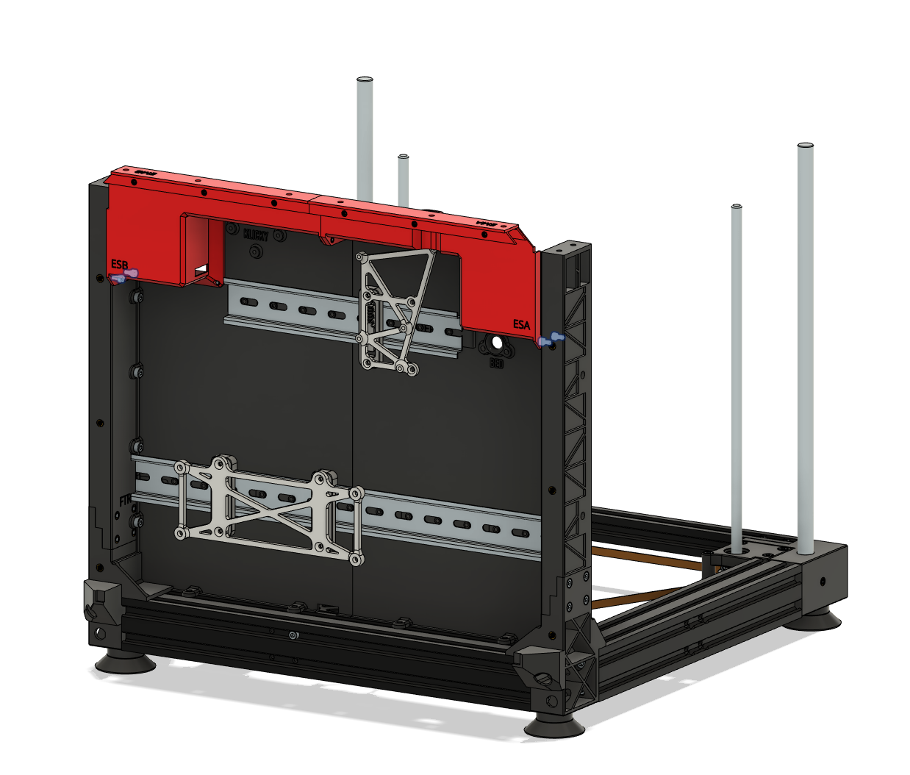
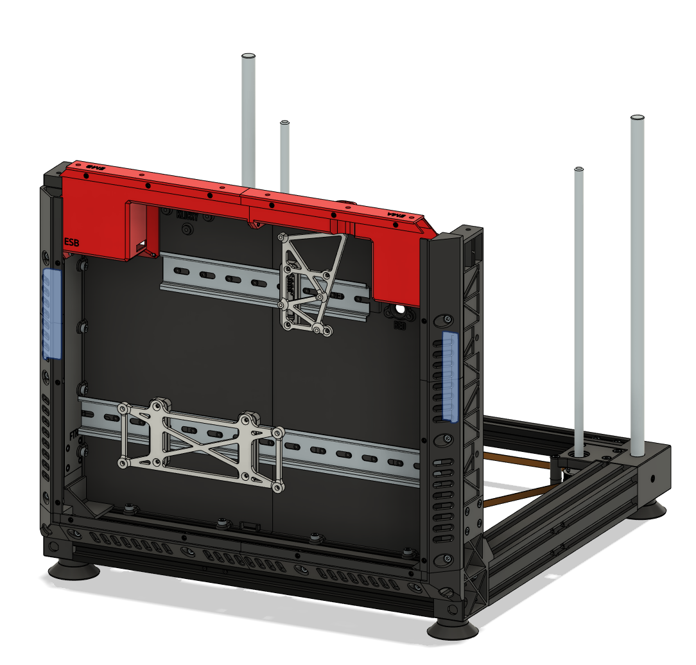

# Eletronics Enclosure

Rear part of the printer

## Table of Contents 

- [BOM](#bom)
- [P - Printed Parts](#p---printed-parts)
- [H - Printed Parts with Heat Inserts](#h---printed-parts-with-heat-insertsmicroswitches)
- [G - Guide](#g---guide)

## BOM

#### General Parts

| Step | Part | Count | Type | Note |
| ---- | ---- | ----- | ---- | ---- |
| [P1](#p1---eng-epb1), [G1](#g1---connect-the-flat-back-plates) | ENG-EPB1 | 1 | Printed
| [P2](#p2---eng-epb2), [G1](#g1---connect-the-flat-back-plates) | ENG-EPB2 | 1 | Printed
| [P3](#p3---eng-epa1), [G1](#g1---connect-the-flat-back-plates) | ENG-EPA1 | 1 | Printed
| [P4](#p4---eng-epa2), [G1](#g1---connect-the-flat-back-plates) | ENG-EPA2 | 1 | Printed
| [G2](#g2---attach-din-rails-to-the-back-plates) | Din Rail 35x200mm | 1 | Electronics
| [G2](#g2---attach-din-rails-to-the-back-plates) | Din Rail 35x350mm | 1 | Electronics
| [G2](#g2---attach-din-rails-to-the-back-plates) | M3x8 | 11 | Hardware | Connect din rails to back plates
| [P5](#p5---eng-din1), [G3](#g3---add-3-eng-din1-and-the-electronics-mounts) | ENG-DIN1 | 1 | Printed
| [P6](#p6---eng-mbe3), [G3](#g3---add-3-eng-din1-and-the-electronics-mounts) | ENG-MBE3 | 1 | Printed
| [G3](#g3---add-3-eng-din1-and-the-electronics-mounts) | M3x8 | 2 | Hardware | Connect ENG-MBE3 to ENG-DIN1
| [H1](#h1---eng-esa), [G4](#g4---attach-eng-esa-and-eng-esb-to-back-plates) | ENG-ESA | 1 | Printed
| [H1](#h1---eng-esa) | M3 heat insert standard | 4 | Hardware | For ENG-ESA
| [H1](#h1---eng-esa) | M3 heat insert short | 2 | Hardware | For ENG-ESA
| [H2](#h2---eng-esb), [G4](#g4---attach-eng-esa-and-eng-esb-to-back-plates) | ENG-ESB | 1 | Printed
| [H2](#h2---eng-esa) | M3 heat insert standard | 4 | Hardware | For ENG-ESB
| [G4](#g4---attach-eng-esa-and-eng-esb-to-back-plates) | M3x6 | 10 | Hardware | Connect ENG-ESA, ENG-ESB, ENG-EPA1, ENG-EPB1
| [H3](#h3---eng-ema-and-eng-emb), [G5](#g5---attach-eng-ema-and-eng-emb) | ENG-EMA | 1 | Printed
| [H3](#h3---eng-ema-and-eng-emb) | M3 heat insert standard | 5 | Hardware | For ENG-EMA
| [H3](#h3---eng-ema-and-eng-emb), [G5](#g5---attach-eng-ema-and-eng-emb) | ENG-EMB | 1 | Printed
| [H3](#h3---eng-ema-and-eng-emb) | M3 heat insert standard | 5 | Hardware | For ENG-EMB
| [G5](#g5---attach-eng-ema-and-eng-emb) | M3x6 | 4 | Hardware | Connect ENG-EMA and ENG-EMB to ENG-ESA and ENG-ESB
| [G6](#g6---attach-side-frame) | M4x8 | 3 | Hardware | Connect left side to ENG-EPA1
| [G6](#g6---attach-side-frame) | M4x8 | 1 | Hardware | Connect left side to ENG-EPA2
| [G6](#g6---attach-side-frame) | M4x8 | 3 | Hardware | Connect right side to ENG-EPB1
| [G6](#g6---attach-side-frame) | M4x8 | 1 | Hardware | Connect right side to ENG-EPB2
| [P9](#p9---eng-est), [G7](#g7---attach-back-plate-to-the-rear-part-of-the-bottom-frame) | ENG-EST | 1 | Printed
| [G7](#g7---attach-back-plate-to-the-rear-part-of-the-bottom-frame) | M4x8 | 4 | Hardware | Connect Back plate to Bottom frame
| [G7](#g7---attach-back-plate-to-the-rear-part-of-the-bottom-frame) | M4 T-nut | 4 | Hardware | Connect Back plate to Bottom frame
| [H4](#h4---eng-efba-and-eng-efbb), [G8.1](#g81---prepare-bottom-frame-rim) | ENG-EFBA | 1 | Printed
| [H4](#h4---eng-efba-and-eng-efbb), [G8.1](#g81---prepare-bottom-frame-rim) | ENG-EFBB | 1 | Printed
| [H4](#h4---eng-efba-and-eng-efbb) | M3 heat insert standard | 4 | For ENG-EFBA and ENG-EFBB
| [P10](#p10---eng-efj), [G8.1](#g81---prepare-bottom-frame-rim) | ENG-EFJ | 1 | Printed
| [G8.2](#g82---screw-bottom-frame-rim-to-back-plate) | M4x10 | 4 | Hardware | Connect ENG-EFBA, ENG-EFBB, and ENG-EFJ to back plate
| [H5](#h5---eng-efla-and-eng-efrb), [#G9.1](#g91---prepare-side-frame-rims) | ENG-EFLA | 1 | Printed
| [H5](#h5---eng-efla-and-eng-efrb), [#G9.1](#g91---prepare-side-frame-rims) | ENG-EFRB | 1 | Printed
| [H5](#h5---eng-efla-and-eng-efrb) | M3 heat insert standard | 4 | For ENG-EFLA and ENG-EFRB
| [H6](#h6---eng-eflb-and-eng-efra), [#G9.1](#g91---prepare-side-frame-rims) | ENG-EFLB | 1 | Printed
| [H6](#h6---eng-eflb-and-eng-efra), [#G9.1](#g91---prepare-side-frame-rims) | ENG-EFRA | 1 | Printed
| [H6](#h6---eng-eflb-and-eng-efra) | M3 heat insert standard | 2 | For ENG-EFLB and ENG-EFRA
| [P10](#p10---eng-efj), [#G9.1](#g91---prepare-side-frame-rims) | ENG-EFJ | 2 | Printed
| [G9.2](#g92---screw-side-frame-rims-to-back-plate) | M4x10 | 6 | Hardware | Connect ENG-EFLA, ENG-EFRB, ENG-EFLB, ENG-EFRA, 2 ENG-EFJ to back plates
| [P11](#p11---eng-kpm), [G10.1](#g101---attach-eng-kpm-to-the-back-plate) | ENG-KPM | 1 | Printed
| [G10.1](#g101---attach-eng-kpm-to-the-back-plate) | M3x8 | 3 | Hardware | Connect ENG-KPM to ENG-EPB1
| [P12](#p12---eng-kpd), [G10.2](#g102---attach-eng-kpd-to-the-back-plate) | ENG-KPD | 1 | Printed
| [G10.2](#g102---attach-eng-kpd-to-the-back-plate) | M3x16 | 2 | Hardware | Connect ENG-KPD to ENG-KPM
| [P13](#p13---eng-ebc), [G11](#g11---attach-eng-ebc-to-back-plate) | ENG-EBC | 1 | Printed
| [G11](#g11---attach-eng-ebc-to-back-plate) | M3x12 | 2 | Hardware | Connect ENG-EBC to ENG-EPA1

#### RF.A - Specific parts for the Printed version of rear frames

| Step | Part | Count | Type | Note |
| ---- | ---- | ----- | ---- | ---- |
| [G6](#g6---attach-side-frame) | M3x6 | 2 | Hardware | Connect ENG-FTL to ENG-ESA
| [G6](#g6---attach-side-frame) | M3x6 | 2 | Hardware | Connect ENG-FTR to ENG-ESB

#### RF.B/RF.C/RF.D - Specific parts for the 2040 aluminium extrusion versions of rear frames

| Step | Part | Count | Type | Note |
| ---- | ---- | ----- | ---- | ---- |
| [G6](#g6---attach-side-frame) | M4 T-nut | 8 | Hardware | Connect sides to back plate
| [G9.2](#g92---screw-side-frame-rims-to-back-plate) | M4 T-nut | 6 | Hardware | Connect frame rim to sides

#### E3.P - Specific parts for Ender 3 Pro

| Step | Part | Count | Type | Note |
| ---- | ---- | ----- | ---- | ---- |
| [P5](#p5---eng-din1), [G3](#g3---add-3-eng-din1-and-the-electronics-mounts) | ENG-DIN1 | 2 | Printed
| [P7:E3.P](#p7e3p---eng-psue3p), [G3](#g3---add-3-eng-din1-and-the-electronics-mounts) | ENG-PSUE3P | 1 | Printed
| [G3](#g3---add-3-eng-din1-and-the-electronics-mounts) | M3x8 | 4 | Hardware | Connect ENG-PSUE3P to ENG-DIN1

#### E3.O - Specific parts for OG Ender 3

| Step | Part | Count | Type | Note |
| ---- | ---- | ----- | ---- | ---- |
| [P8:E3.O](#p8e3o---eng-psue3), [G3](#g3---add-3-eng-din1-and-the-electronics-mounts) | ENG-PSUE3 | 2 | Printed
| [P5](#p5---eng-din1), [G3](#g3---add-3-eng-din1-and-the-electronics-mounts) | ENG-DIN1 | 0/2 | Printed | It may be required to hold PSUE3
| [G3](#g3---add-3-eng-din1-and-the-electronics-mounts) | M3x8 | 0/4 | Hardware | It may be required to hold PSUE3

## P - Printed Parts

This section just lists the printed parts that do not require any additional preparation. Unless stated otherwise, print one of each.

#### P1 - ENG-EPB1

Electronics enclosure - panel B1

#### P2 - ENG-EPB2

Electronics enclosure - panel B2

#### P3 - ENG-EPA1

Electronics enclosure - panel A1

#### P4 - ENG-EPA2

Electronics enclosure - panel A2

#### P5 - ENG-DIN1

DIN rail mount

#### P6 - ENG-MBE3

MOTHERBOARD

#### P7:E3.P - ENG-PSUE3P

**Note: This part is only valid for Ender 3 Pro**

PSU MOUNT

#### P8:E3.O - ENG-PSUE3

**Note: This part is only valid for OG Ender 3**

50mm PSU mount

#### P9 - ENG-EST

Electronics enclosure – stepper cable cover

#### P10 - ENG-EFJ

Electronics enclosure - frame joint

#### P11 - ENG-KPM

Klicky probe – dock mount

#### P12 - ENG-KPD

Klicky probe - dock original

#### P13 - ENG-EBC

Electronics enclosure – bed cable

## H - Printed Parts with Heat Inserts/Microswitches

This section lists printed parts that require an initial preparation, such as adding heat inserts or installing microswitches.

#### H1 - ENG-ESA

Electronics enclosure - stepper cover A

This part has 4 standard M3 heat inserts and 2 short M3 heat inserts. The standard ones are visible in the figure above. The short ones are on the side:

#### H2 - ENG-ESB

Electronics enclosure - stepper cover B

This part has 4 standard M3 heat inserts that are visible in the figure above.

#### H3 - ENG-EMA and ENG-EMB

ENG-EMA and ENG-EMB are mirrored parts:

- ENG-EMA: Electronics enclosure - frame mount part A
- ENG-EMB: Electronics enclosure - frame mount part B

Each part has 5 standard M3 heat inserts.

#### H4 - ENG-EFBA and ENG-EFBB

ENG-EFBA and ENG-EFBB are mirrored parts:

- ENG-EFBA: Electronics enclosure - frame rim bottom part A
- ENG-EFBB: Electronics enclosure - frame rim bottom part B

Each part has 2 standerd M3 heat inserts, as shown above.

#### H5 - ENG-EFLA and ENG-EFRB

ENG-EFLA and ENG-EFRB are mirrored parts:

- ENG-EFLA: Electronics enclosure - frame rim left part A
- ENG-EFRB: Electronics enclosure - frame rim right part B

Each part has 2 standerd M3 heat inserts, as shown above.

#### H6 - ENG-EFLB and ENG-EFRA

ENG-EFLB and ENG-EFRA are mirrored parts:

- ENG-EFLB: Electronics enclosure - frame rim left part B
- ENG-EFRA: Electronics enclosure - frame rim right part A

Each part has 1 standerd M3 heat inserts, as shown above.

## G - Guide

#### G1 - Connect the flat back plates

Use ENG-EPA1, ENG-EPA2, ENG-EPB1, ENG-EPB2

#### G2 - Attach Din Rails to the back plates

Use 1 35x200mm din rail on top and 1 35x350mm on the bottom and as many M3x8 screws as you need to hold it in place. In this guide I will go with 11 M3x8:

- 3 on ENG-EPB1
- 3 on ENG-EPA1
- 1 between ENG-EPB1 and ENG-EPA1
- 2 on ENG-EPB2
- 2 on ENG-EPA2

#### G3 - Add 3 ENG-DIN1 and the electronics mounts

Prepare the mounts for the electronics.

For the Ender 3 motherboard (both OG, Pro, or SKR Mini E3), use 1 ENG-DIN1, 1 ENG-MBE3, and 2 M3x8

For the PSU, it varies according to the source printer:

- Ender 3 Pro (figure above): 2 ENG-DIN1, 1 ENG-PSUE3P, 4 M3x8
- OG Ender 3: 2 ENG-PSUE3 (and maybe 2 ENG-DIN1 with 4 M3x8)

#### G4 - Attach ENG-ESA and ENG-ESB to back plates

Use 8 M3x6 to attach ENG-ESA and ENG-ESB to the back plates and 2 M3x6 to attach ENG-ESA to ENG-ESB

#### G5 - Attach ENG-EMA and ENG-EMB

Use 4 M3x6 to attach ENG-EMA and ENG-EMB to ENG-ESA and ENG-ESB

#### G6 - Attach side frame

For each side:

- Use 3 M4x8 to attach side to ENG-EPA1/ENG-EPB1. 
- Use 1 M4x8 to attach side to ENG-EPA2/ENG-EPB2. 

If you are using aluminium extrusion sides (RF.B, RF.C, RF.D), use 4 M4 T-nuts in each side too. Prepare them in advance and slide back plate into position.

If you are using printed version (RF.A), use 2 M3x6 to attach ENG-FLT/ENG-FTR to ENG-ESA/ENG-ESB. 

#### G7 - Attach Back plate to the rear part of the bottom frame

Use 4 M4x8, 4 M4 T-nuts, and add ENG-EST in the proper position.

#### G8 - Attach Bottom Frame Rim

It has two steps:

#### G8.1 - Prepare Bottom Frame Rim

Glue 1 ENG-EFJ to ENG-EFBA and ENG-EFBB.

#### G8.2 - Screw Bottom Frame Rim to Back Plate

Use 4 M4x10.

#### G9 - Do the same for the Frame Rim of the sides

#### G9.1 - Prepare Side Frame Rims

Glue 1 ENG-EFJ to ENG-EFLA and ENG-EFLB.
Glue 1 ENG-EFJ to ENG-EFRA and ENG-EFRB.

#### G9.2 - Screw Side Frame Rims to Back Plate

Use 6 M4x10.

If you are using aluminium extrusion sides (RF.B, RF.C, RF.D), use 6 M4 T-nuts.

#### G10 - Install Klicky mount

#### G10.1 - Attach ENG-KPM to the back plate

Use 3 M3x8.

#### G10.2 - Attach ENG-KPD to the back plate

Use 2 M3x16.

### G11 - Attach ENG-EBC to back plate

Use 2 M3x12.

Note: you may need to remove it and reinsert it after inserting the bed for the wiring.

## Next step:

Go to [3.bed](../3.bed/bed.md).
