# Bed 

Z - bed carriage

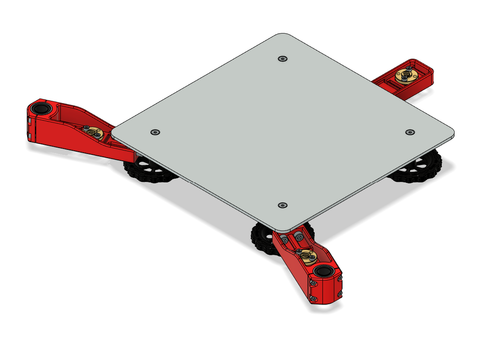

## Table of Contents 

- [BOM](#bom)
- [P - Printed Parts](#p---printed-parts)
- [H - Printed Parts with Heat Inserts](#h---printed-parts-with-heat-insertsmicroswitches)
- [G - Guide](#g---guide)

## BOM

#### General Parts

| Step | Part | Count | Type | Note |
| ---- | ---- | ----- | ---- | ---- |
| [P1](#p1---eng-zcl), [G1](#g1---prepare-side-bed-carriages) | ENG-ZCL | 2 | Printed
| [H1](#h1---eng-zca-and-eng-zcb), [G1](#g1---prepare-side-bed-carriages) | ENG-ZCA | 1 | Printed
| [H1](#h1---eng-zca-and-eng-zcb) | M3 heat insert standard | 4 | Hardware | For ENG-ZCA
| [H1](#h1---eng-zca-and-eng-zcb), [G1](#g1---prepare-side-bed-carriages) | ENG-ZCB | 1 | Printed
| [H1](#h1---eng-zca-and-eng-zcb) | M3 heat insert standard | 4 | Hardware | For ENG-ZCB
| [G1](#g1---prepare-side-bed-carriages) | M3x8 | 8 | Hardware | Connect ENG-ZCL to ENG-ZCA/ENG-ZCB
| [G1](#g1---prepare-side-bed-carriages) | LM12UU linear bearing | 2 | Motion
| [P2](#p2---eng-zcc), [G2](#g2---add-leadscrew-nuts-to-eng-zca-eng-zcb-and-eng-zcc) | ENG-ZCC | 1 | Printed
| [G2](#g2---add-leadscrew-nuts-to-eng-zca-eng-zcb-and-eng-zcc) | T8/8 leadscrew nut | 3 | Motion 
| [G2](#g2---add-leadscrew-nuts-to-eng-zca-eng-zcb-and-eng-zcc) | M3x12 | 6 | Hardware | Connect leadscrew nuts to ENG-ZCA, ENG-ZCB, ENG-ZCC
| [H2](#h2---eng-zcd), [G3](#g3---screw-the-middle-part-of-the-bed-carriage) | ENG-ZCD | 1 | Printed
| [H2](#h2---eng-zcd) | M5 heat insert standard | 6 | Hardware | For ENG-ZCD
| [G3](#g3---screw-the-middle-part-of-the-bed-carriage) | M5x12 | 6 | Hardware | Connect ENG-ZCD to ENG-ZCA, ENG-ZCB, and ENG-ZCC
| [H3](#h3---eng-zce), [G4](#g4---add-cable-mount-part) | ENG-ZCE | 1 | Printed
| [H3](#h3---eng-zce) | M5 heat insert standard | 1 | Hardware | For ENG-ZCE
| [G4](#g4---add-cable-mount-part) | M5x16 | 1 | Hardware | Connect ENG-ZCE to ENG-ZCD
| [G5](#g5---add-heatbed-to-carriage) | Heated Bed | 1 | Ender 3 | 
| [G5](#g5---add-heatbed-to-carriage) | Bed Wheel | 4 | Ender 3 | 
| [G5](#g5---add-heatbed-to-carriage) | M4 Washer | 4 | Hardware | 
| [G5](#g5---add-heatbed-to-carriage) | Silicone Spacer | 4 | Hardware | 
| [G5](#g5---add-heatbed-to-carriage) | M4x30 | 4 | Hardware | 

## P - Printed Parts

This section just lists the printed parts that do not require any additional preparation. Unless stated otherwise, print one of each.

#### P1 - ENG-ZCL

Z - bed carriage bearing lock.

Print 2

#### P2 - ENG-ZCC

Z - bed carriage C (rear)

## H - Printed Parts with Heat Inserts/Microswitches

This section lists printed parts that require an initial preparation, such as adding heat inserts or installing microswitches.

#### H1 - ENG-ZCA and ENG-ZCB

ENG-ZCA and ENG-ZCB are mirrored parts.
- ENG-ZCA: Z - bed carriage A (left)
- ENG-ZCB: Z - bed carriage B (right)

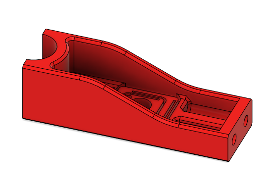
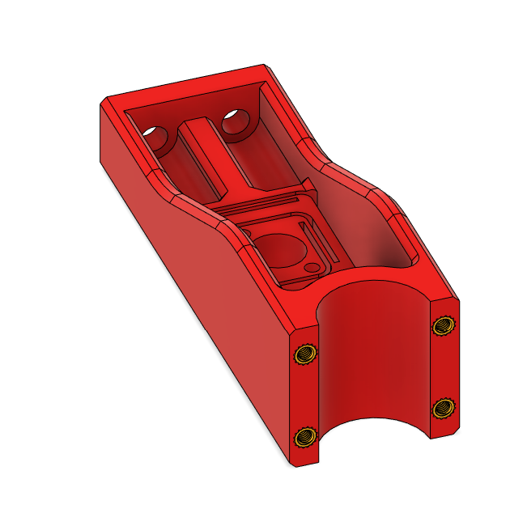

Each part has 4 standard M3 heat inserts.

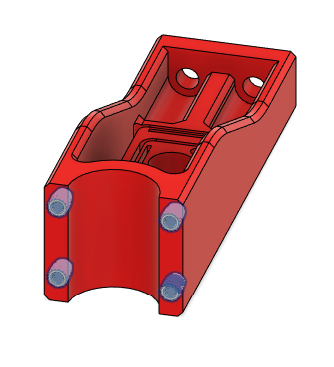

#### H2 - ENG-ZCD

Z - bed carriage D (middle)

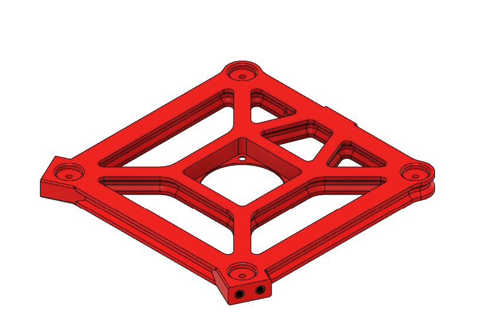

It has 6 standard M5 heat inserts.

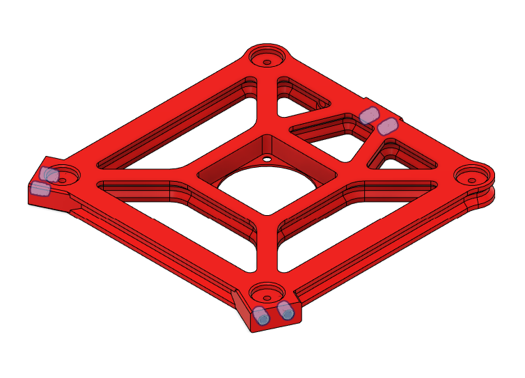

#### H3 - ENG-ZCE

Z - bed carriage E (cable mount)

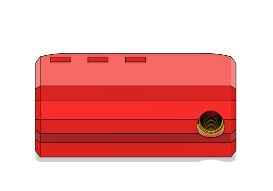

It has 1 standard M5 heat inserts, as shown above.

## G - Guide

#### G1 - Prepare side bed carriages

- Use 4 M3x8 screws to hold LM12UU between ENG-ZCA and ENG-ZCL 
- Use 4 M3x8 screws to hold LM12UU between ENG-ZCB and ENG-ZCL

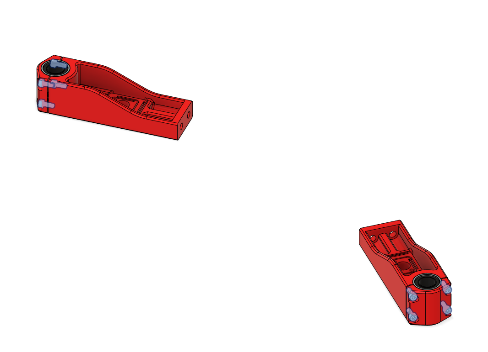

#### G2 - Add leadscrew nuts to ENG-ZCA, ENG-ZCB, and ENG-ZCC

Use 2 M3x12 in each part:

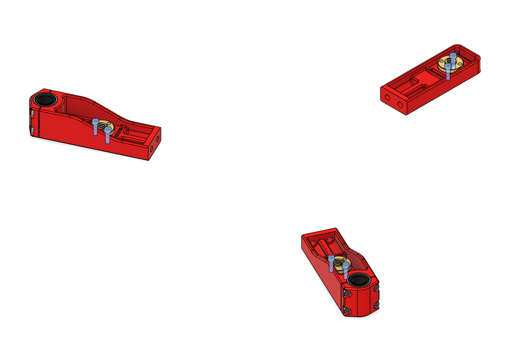

#### G3 - Screw the middle part of the bed carriage

Use 6 M5x12 to connect ENG-ZCA, ENG-ZCB, and ENG-ZCC to ENG-ZCD.

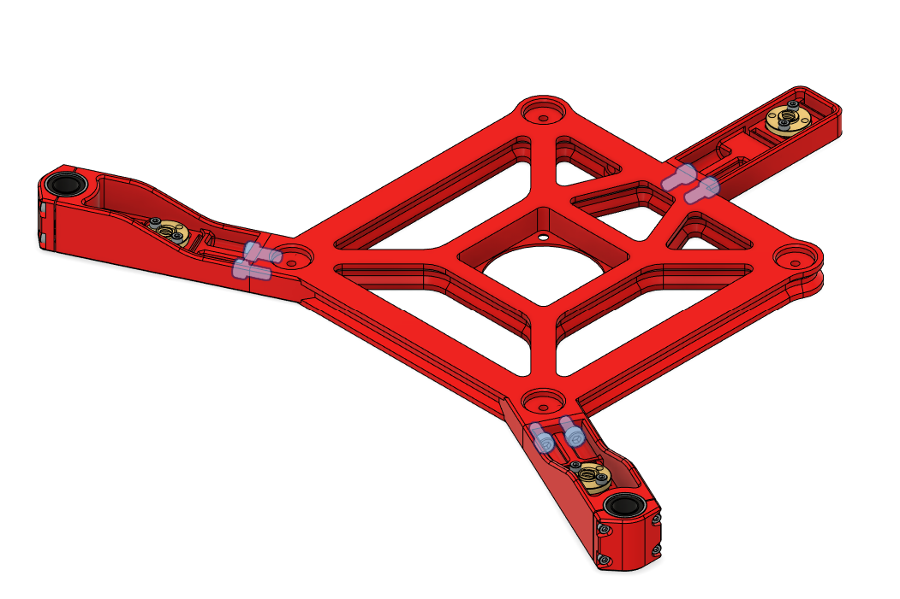

#### G4 - Add cable mount part

Use 1 M5x16 to connect ENG-ZCE to ENG-ZCD.

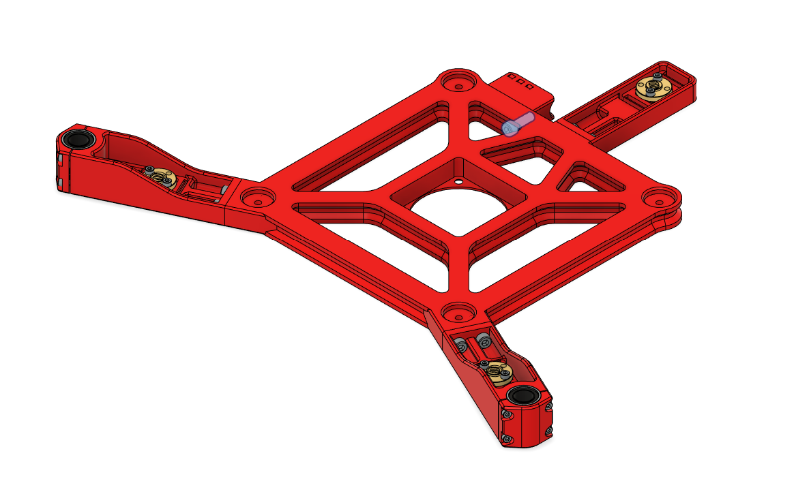

#### G5 - Add heatbed to carriage

For each hole of the bed, use 1 wheel, 1 M4 washer, 1 silicone spacer, and 1 M4x30. Below ENG-ZCD, add the wheel and the washer. Above it, add the silicone spacer, the bed, and close everything with the screw.

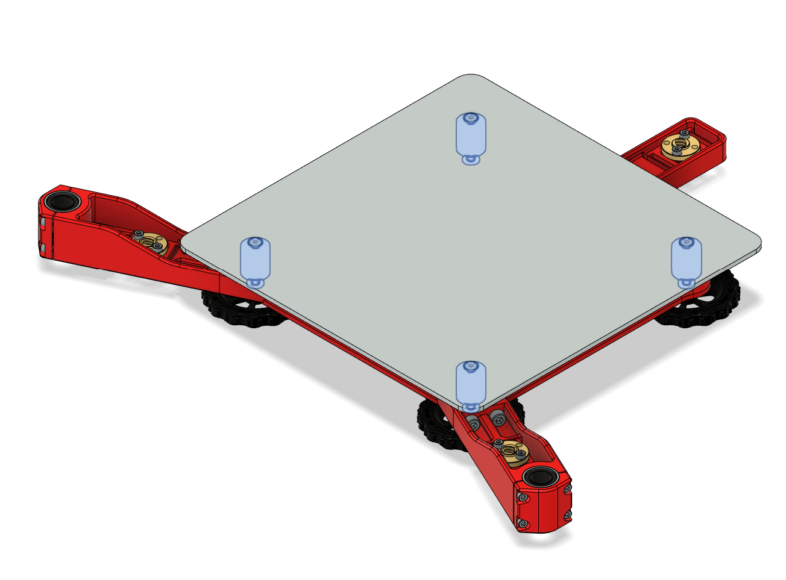

#### G6 - Add bed to build

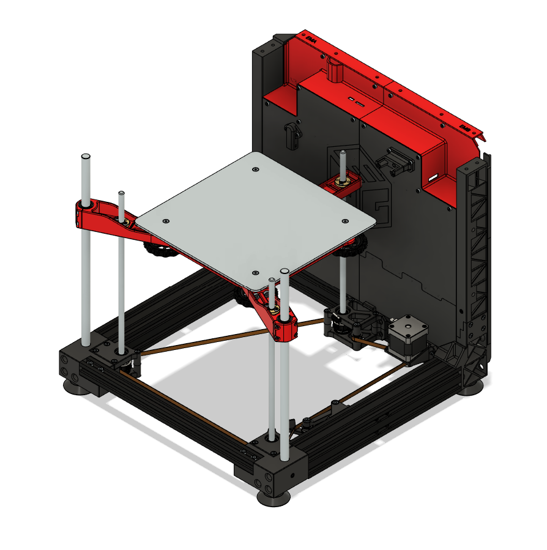
