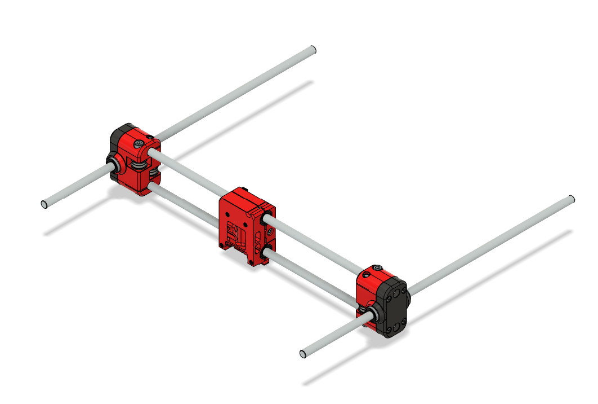
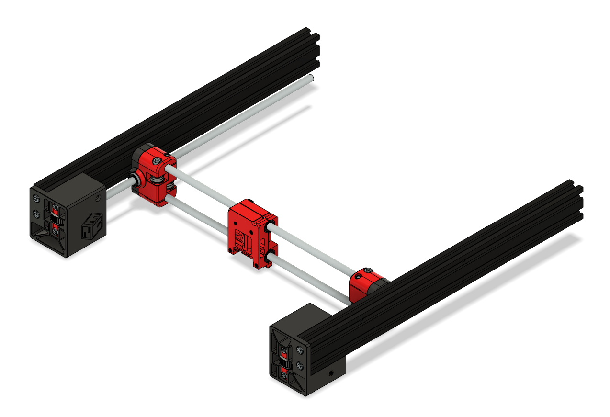
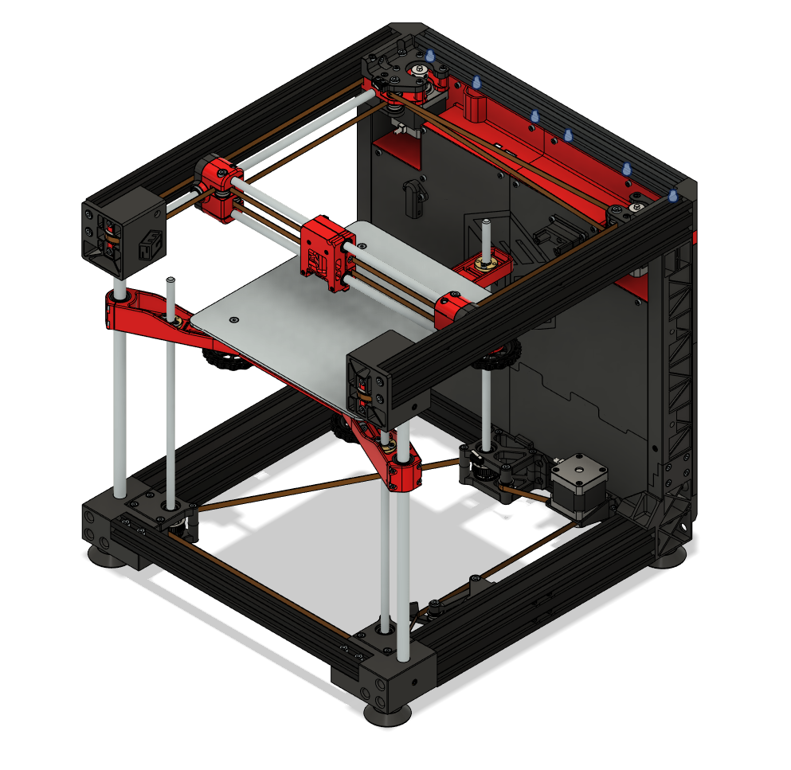

# Top

Top frame with X and Y gantry.

## Table of Contents 

- [BOM](#bom)
- [P - Printed Parts](#p---printed-parts)
- [H - Printed Parts with Heat Inserts](#h---printed-parts-with-heat-insertsmicroswitches)
- [G - Guide](#g---guide)

## BOM

#### General Parts

| Step | Part | Count | Type | Note |
| ---- | ---- | ----- | ---- | ---- |
| [P1](#p1---eng-ygb), [G1.1](#g11---y-axis-gantry) | ENG-YGB | 2 | Printed
| [H1](#h1---eng-yga), [G1.1](#g11---y-axis-gantry) | ENG-YGA | 2 | Printed
| [H1](#h1---eng-yga) | M3 heat insert standard | 8 | Hardware | For ENG-YGA
| [H1](#h1---eng-yga) | M5 heat insert short | 4 | Hardware | For ENG-YGA
| [G1.1](#g11---y-axis-gantry) | M3x16 | 8 | Hardware | Connect ENG-YGAs to ENG-YGBs
| [G1.1](#g11---y-axis-gantry) | LM8LUU | 2 | Motion |
| [H2](#h2---eng-xc0), [G1.2](#g12---x-axis-gantry) | ENG-XC0 | 1 | Printed
| [H2](#h2---eng-xc0) | M4 heat insert standard | 2 | Hardware | For ENG-XC0
| [H2](#h2---eng-xc0) | Microswitch D2F-L | 1 | Electronics | For ENG-XC0
| [H2](#h2---eng-xc0) | M2x8 | 2 | Hardware | For ENG-XC0
| [H3](#h3---eng-xc1), [G1.2](#g12---x-axis-gantry) | ENG-XC1 | 1 | Printed
| [H3](#h3---eng-xc1) | M3 heat insert standard | 8 | Hardware | For ENG-XC1
| [G1.2](#g12---x-axis-gantry) | M3x12 | 4 | Hardware | Connect ENG-XC0 to ENG-XC1
| [G1.2](#g12---x-axis-gantry) | LM8LUU | 2 | Motion |
| [G1.3](#g13---insert-the-linear-rods) | X and Y linear rods 8x350mm | 4 | Motion
| [G1.4](#g14---add-bearings-to-each-side) | M5 Washer | 8 | Hardware
| [G1.4](#g14---add-bearings-to-each-side) | M5x50 | 4 | Hardware
| [G1.4](#g14---add-bearings-to-each-side) | F695 Bearing | 8 | Motion
| [P2](#p2---eng-bt1), [G2.1](#g21---prepare-middle-of-tensioners) | ENG-BT1 | 2 | Printed
| [P3](#p3---eng-bt2), [G2.1](#g21---prepare-middle-of-tensioners) | ENG-BT2 | 2 | Printed
| [P4](#p4---eng-btp), [G2.1](#g21---prepare-middle-of-tensioners) | ENG-BTP | 2 | Printed
| [G2.1](#g21---prepare-middle-of-tensioners) | M5 Nut | 2 | Hardware | For ENG-BT2
| [G2.1](#g21---prepare-middle-of-tensioners) | M5 Washer | 8 | Hardware | For ENG-BTP
| [G2.1](#g21---prepare-middle-of-tensioners) | F695 Bearing | 4 | Motion | For ENG-BTP
| [G2.1](#g21---prepare-middle-of-tensioners) | M5x20 | 2 | Hardware | Connect ENG-BT1, ENG-BTP, and ENG-BT2
| [G2.2](#g22---add-other-screws-to-tensioners) | M4 Nut | 4 | Hardware | For ENG-BT1 and ENG-BT2
| [G2.2](#g22---add-other-screws-to-tensioners) | M4x25 | 4 | Hardware | For ENG-BT1 and ENG-BT2
| [H4](#h4---eng-tfl-and-eng-tfr), [G2.3](#g23---insert-tensioners-into-eng-tfleng-tfr) | ENG-TFL | 1 | Printed
| [H4](#h4---eng-tfl-and-eng-tfr) | M4 heat insert standard | 3 | Hardware | For ENG-TFL
| [H4](#h4---eng-tfl-and-eng-tfr), [G2.3](#g23---insert-tensioners-into-eng-tfleng-tfr) | ENG-TFR | 1 | Printed
| [H4](#h4---eng-tfl-and-eng-tfr) | M4 heat insert standard | 3 | Hardware | For ENG-TFR
| [G2.5](#g25---attach-tensioners-to-2040-riser-frames) | 2040 Riser Frame | 2 | Ender 3
| [G2.5](#g25---attach-tensioners-to-2040-riser-frames) | M5x12 | 4 | Hardware | Connect ENG-TFL/ENG-TFR to Riser Frames
| [G2.5](#g25---attach-tensioners-to-2040-riser-frames) | M4x8 | 4 | Hardware | Connect ENG-TFL/ENG-TFR to Riser Frames
| [G2.5](#g25---attach-tensioners-to-2040-riser-frames) | M4 T-nut | 4 | Hardware | Connect ENG-TFL/ENG-TFR to Riser Frames
| [H5](#h5---eng-ma2), [G3.1.1](#g311---attach-eng-ma2) | ENG-MA2 | 1 | Printed
| [H5](#h5---eng-ma2) | M5 heat insert short | 1 | Hardware | For ENG-MA2
| [H6](#h6---eng-ma3), [G3.1.2](#g312---attach-eng-ma3) | ENG-MA3 | 1 | Printed
| [H6](#h6---eng-ma3) | M3 heat insert standard | 2 | Hardware | For ENG-MA3
| [H6](#h6---eng-ma3) | M5 heat insert short | 1 | Hardware | For ENG-MA3
| [G3.1.2](#g312---attach-eng-ma3) | M4x8 | 1 | Hardware | Connect ENG-MA3 to 2040 frame
| [G3.1.2](#g312---attach-eng-ma3) | M4 T-nut | 1 | Hardware | Connect ENG-MA3 to 2040 frame
| [G3.1.2](#g312---attach-eng-ma3) | M5 Washer | 2 | Hardware | Between ENG-MA2 and ENG-MA3
| [G3.1.2](#g312---attach-eng-ma3) | F695 Bearing | 2 | Hardware | Between ENG-MA2 and ENG-MA3
| [G3.1.3](#g313---prepare-bearing-the-same-way-above-eng-ma3) | M5 Washer | 4 | Hardware | Between ENG-MA2 and ENG-MA1
| [G3.1.3](#g313---prepare-bearing-the-same-way-above-eng-ma3) | F695 Bearing | 4 | Hardware | Between ENG-MA2 and ENG-MA1
| [H7](#h7---eng-ma1), [G3.1.4](#g314---attach-eng-ma1) | ENG-MA1 | 1 | Printed
| [H7](#h7---eng-ma1) | Microswitch D2F-L | 1 | Electronics | For ENG-MA1
| [H7](#h7---eng-ma1) | M2x8 | 2 | Hardware | For ENG-MA1
| [G3.1.4](#g314---attach-eng-ma1) | M4 T-nut | 1 | Hardware | Connect ENG-MA1 to frame
| [G3.1.4](#g314---attach-eng-ma1) | M4x8 | 1 | Hardware | Connect ENG-MA1 to frame
| [G3.1.4](#g314---attach-eng-ma1) | M5x12 | 1 | Hardware | Connect ENG-MA1 to frame
| [G3.1.4](#g314---attach-eng-ma1) | M3x30 | 2 | Hardware | Connect ENG-MA1 to ENG-MA2 and ENG-MA3
| [G3.1.4](#g314---attach-eng-ma1) | M5x20 | 1 | Hardware | Connect ENG-MA1 to ENG-MA2 and ENG-MA3
| [G3.1.4](#g314---attach-eng-ma1) | M5x35 | 1 | Hardware | Connect ENG-MA1 to ENG-MA2 and ENG-MA3
| [G3.1.5](#g315---mount-nema-17) | M3x25 | 4 | Hardware | Connect Nema 17 to Motor mount A
| [G3.1.5](#g315---mount-nema-17) | Nema 17 | 4 | Ender 3 |
| [H8](#h8---eng-mb3), [G3.2.1](#g321---attach-eng-mb3) | ENG-MB3 | 1 | Printed
| [H8](#h8---eng-mb3) | M3 heat insert standard | 2 | Hardware | For ENG-MB3
| [H8](#h8---eng-mb3) | M5 heat insert short | 2 | Hardware | For ENG-MB3
| [G3.2.1](#g321---attach-eng-mb3) | M4x8 | 1 | Hardware | Connect ENG-MB3 to frame
| [G3.2.1](#g321---attach-eng-mb3) | M4 T-nut | 1 | Hardware | Connect ENG-MB3 to frame
| [G3.2.2](#g322---prepare-bearings) | M5 Washer | 4 | Hardware | Between ENG-MB3 and ENG-MB2
| [G3.2.2](#g322---prepare-bearings) | F695 Bearing | 4 | Hardware | Between ENG-MB3 and ENG-MB2
| [P5](#p5---eng-mb2), [G3.2.3](#g323---attach-eng-mb2) | ENG-MB2 | 1 | Printed
| [G3.2.3](#g323---attach-eng-mb2) | M4 T-nut | 1 | Hardware | Connect ENG-MB2 to frame
| [G3.2.3](#g323---attach-eng-mb2) | M4x8 | 1 | Hardware | Connect ENG-MB2 to frame
| [G3.2.3](#g323---attach-eng-mb2) | M5x12 | 2 | Hardware | Connect ENG-MB2 to frame
| [G3.2.3](#g323---attach-eng-mb2) | M5x16 | 1 | Hardware | Connect ENG-MB2 to ENG-MB3
| [G3.2.4](#g324---prepare-bearing) | M5 Washer | 2 | Hardware | Between ENG-MB2 and ENG-MB1
| [G3.2.4](#g324---prepare-bearing) | F695 Bearing | 2 | Hardware | Between ENG-MB2 and ENG-MB1
| [P6](#p6---eng-mb1), [G3.2.5](#g325---attach-eng-mb1) | ENG-MB1 | 1 | Printed
| [G3.2.5](#g325---attach-eng-mb1) | M3x30 | 2 | Hardware | Connect ENG-MB1 to ENG-MB2 and ENG-MB3
| [G3.2.5](#g325---attach-eng-mb1) | M5x30 | 1 | Hardware | Connect ENG-MB1 to ENG-MB2 and ENG-MB3
| [G3.2.6](#g315---mount-nema-17) | M3x20 | 4 | Hardware | Connect Nema 17 to Motor mount B
| [G3.2.6](#g315---mount-nema-17) | Nema 17 | 4 | Ender 3 |
| [G4](#g4---attach-back-frame) | M5x12 | 2 | Hardware | Connect back frame to motor mounts
| [P7](#p7---eng-xcb), [G5](#g5---insert-belts) | ENG-XCB | 2 | Printed
| [G5](#g5---insert-belts) | M4x10 | 2 | Hardware | Connect ENG-XCB to ENG-XC0
| [G5](#g5---insert-belts) | GT2 belt 6mm | 2 | Motion | X and Y belt
| [G6](#g6---mount-top-frame-to-the-rest-of-the-printer) | M4 T-nut | 10 | Hardware | Connect top frame to printer
| [G6](#g6---mount-top-frame-to-the-rest-of-the-printer) | M4x6 | 6 | Hardware | Connect top frame to printer
| [G6](#g6---mount-top-frame-to-the-rest-of-the-printer) | M4x8 | 4 | Hardware | Connect top frame to printer
| [G6](#g6---mount-top-frame-to-the-rest-of-the-printer) | M4x8 grubscrew | 2 | Hardware | Connect top frame to printer
| [P8](#p8---eng-ecs), [G7](#g7---install-cable-strain-mount) | ENG-ECS | 1 | Printed
| [G7](#g7---install-cable-strain-mount) | M4 T-nut | 2 | Hardware | Connect ENG-ECS to frame
| [G7](#g7---install-cable-strain-mount) | M4x6 | 2 | Hardware | Connect ENG-ECS to frame

## P - Printed Parts

This section just lists the printed parts that do not require any additional preparation. Unless stated otherwise, print one of each.

#### P1 - ENG-YGB

Y axis gantry B

Print 2.

#### P2 - ENG-BT1

Belt tensioner body 1

Print 2.

#### P3 - ENG-BT2

Belt tensioner body 2

Print 2.

#### P4 - ENG-BTP

Belt tensioner pulley

Print 2.

#### P5 - ENG-MB2

XY Motor mount B2

#### P6 - ENG-MB1

XY Motor mount B1

#### P7 - ENG-XCB

X carriage belt

Print 2.

#### P8 - ENG-ECS

Electornics enclosure - cable strain

## H - Printed Parts with Heat Inserts/Microswitches

This section lists printed parts that require an initial preparation, such as adding heat inserts or installing microswitches.

#### H1 - ENG-YGA

Y axis gantry A

Print 2.

It has 4 standard M3 heat inserts and 2 short M5 heat inserts.

The first figure above shows the positions of M3 heat inserts, and the second shows the positions of M5 ones.

#### H2 - ENG-XC0

X carriage - backplate

It has 2 standard M4 heat inserts.

It also has 1 microswitch D2F-L that server as a min X endstop. Hold it with 2 M2x8

#### H3 - ENG-XC1

X carriage - frontplate

It has 8 standard M3 heat inserts.

#### H4 - ENG-TFL and ENG-TFR

ENG-TFL and ENG-TFR are mirrored parts.
- ENG-TFL: Top Frame Left
- ENG-TFR: Top Frame Right

Each part has 3 standard M4 heat inserts

#### H5 - ENG-MA2

XY Motor mount A2

It has 1 short M5 heat insert, as presented above.

#### H6 - ENG-MA3

XY Motor mount A3

It has 2 standard M3 heat inserts and 1 short M5 heat insert, as presented above.

#### H7 - ENG-MA1

XY Motor mount A1

It has 1 microswitch D2F-L that serves as min Y endstop, as presented above. Connect it using 2 M2x8.

#### H8 - ENG-MB3

XY Motor mount B3

It has 2 standard M3 heat inserts and 2 short M5 heat inserts.

## G - Guide

This part of guide has multiple sub-steps. In each step, I will show the result, and then proceed to the sub-steps.

#### G1 - Prepare Y and X Gantry

#### G1.1 - Y axis Gantry

- Use 4 M3x16 to hold LM8LUU between ENG-YGA and ENG-YGB (right)
- Use 4 M3x16 to hold LM8LUU between ENG-YGA and ENG-YGB (left)

#### G1.2 - X axis Gantry

- Use 4 M3x12 to hold 2 LM8LUU between ENG-XC0 and ENG-XC1

#### G1.3 - Insert the linear rods

- X and Y linear rods 8x350mm

#### G1.4 - Add bearings to each side

- Use 8 M5 washers, 8 F695 bearings, and M5x50

The assembly of the bearings looks as follows:

#### G2 - Prepare the front frame

#### G2.1 - Prepare middle of tensioners

Let's start by mounting 2 tensioners. For each tensioner:

- Insert 1 M5 Nut below ENG-BT2
- Insert 2 M5 Washers inside ENG-BTP
- Insert 1 F695 bearing below ENG-BTP and 1 F695 bearing above ENG-BTP
- Insert 1 M5 Washer below ENG-BTP and 1 M5 Washer abobe ENG-BTP
- Hold everything in place with 1 M5x20

#### G2.2 - Add other screws to tensioners

For each tensioner, insert 2 M4 Nut and 2 M4x25

#### G2.3 - Insert tensioners into ENG-TFL/ENG-TFR

Use screws from the previous step

#### G2.4 - Insert other tensioner screws

For each side, use 2 M4x25

#### G2.5 - Attach tensioners to 2040 Riser Frames

For each side, use 2 M5x12, 2 M4x8, and 2 M4 T-nut. The M5x12 screws go on the end of the 2040 frames.

#### G2.6 - Connect Y axis gantry to ENG-TFL/ENG-TFR

 

#### G3 - Prepare A/B Stepper Mounts

#### G3.1 - Motor A (Left)

#### G3.1.1 - Attach ENG-MA2

Use 1 M5x12 to attach ENG-MA2 to the left frame

#### G3.1.2 - Attach ENG-MA3

Use 1 M4x8 and 1 M4 T-nut to attach ENG-MA3 to the left frame. Add bearing mount between it ENG-MA2. For the bearing, make "sandwich" with 1 M5 washer, 1 F695 bearing, 1 F695 bearing, and 1 M5 washer.

#### G3.1.3 - Prepare bearing the same way above ENG-MA3

Use 4 M5 washers and 4 F695 bearings

#### G3.1.4 - Attach ENG-MA1

- Use 1 M4 T-nut, 1 M4x8, and 1 M5x12 to attach ENG-MA1 to frame
- Us 2 M3x30, 1 M5x20, and 1 M5x35 to attach ENG-MA1 to ENG-MA2 and ENG-MA3

#### G3.1.5 - Mount Nema 17

Use 4 M3x25 to attach Nema 17

#### G3.2 - Motor B (Right)

#### G3.2.1 - Attach ENG-MB3

Use 1 M4x8 and 1 M4 T-nut to attach ENG-MB3 to the right frame

#### G3.2.2 - Prepare bearings

Use 4 M5 washers and 4 F695 bearings

#### G3.2.3 - Attach ENG-MB2

- Use 1 M4 T-nut, 1 M4x8 and 2 M5x12 to attach it to frame
- Use 1 M5x16 to attach it to ENG-MB3

#### G3.2.4 - Prepare bearing

Use 2 M5 washers and 2 F695 bearings

#### G3.2.5 - Attach ENG-MB1

Use 2 M3x30 and 1 M5x30

#### G3.2.6 - Mount Nema 17

Use 4 M3x20 to attach Nema 17

#### G4 - Attach back frame

Use 2 M5x12

#### G5 - Insert Belts

Hold them on X Carriage with 2 ENG-XCB and 2 M4x10. Make sure you follow the path below. You may need to reassemble some parts.

 

#### G6 - Mount top frame to the rest of the printer

- Use 6 M4 T-nut and 6 M4x6 to connect to electronics enclosure
- Use 4 M4 T-nut and 4 M4x8 to connect to the sides
- Use 2 M4x8 grubscrews to connect to Z linear rods

#### G7 - Install Cable Strain Mount

Use 2 M4 T-nut and 2 M4x6

