# Hotend/Extruder

Hotend and extruder.

At this moment, I will only show how to mount the V6-bowden hotend, as it is what exists on the .step file.

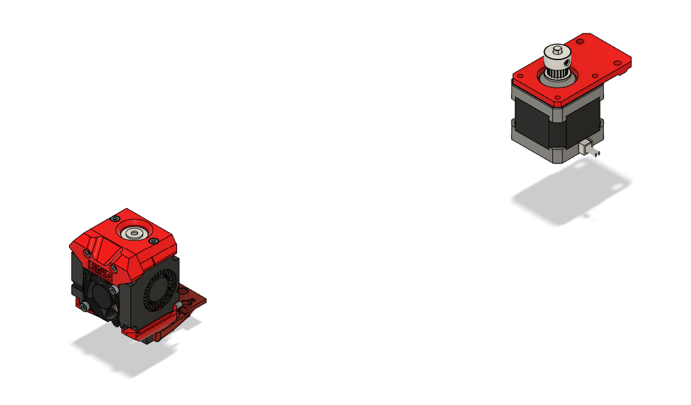

## Table of Contents 

- [BOM](#bom)
- [P - Printed Parts](#p---printed-parts)
- [H - Printed Parts with Heat Inserts](#h---printed-parts-with-heat-insertsmicroswitches)
- [G - Guide](#g---guide)

## BOM

#### General Parts

| Step | Part | Count | Type | Note |
| ---- | ---- | ----- | ---- | ---- |
| [H1](#h1---eng-xcf), [G1.1](#g11---attach-eng-xcf-to-x-carriage) | ENG-XCF | 1 | Printed
| [H1](#h1---eng-xcf) | M3 heat insert standard | 5 | Hardware | For ENG-XCF
| [H2](#h2---eng-xch), [G1.2](#g12---add-v6-hotend-and-hold-it-in-place-with-eng-xch) | ENG-XCH | 1 | Printed
| [H2](#h2---eng-xch) | M3 heat insert standard | 1 | Hardware | For ENG-XCH
| [G1.3](#g13---add-fans) | 3010 24V axial fan | 1 | Electronics 
| [G1.3](#g13---add-fans) | 4010 24V radial fan | 2 | Electronics 
| [G1.3](#g13---add-fans) | M3x12 | 2 | Hardware | Connect 3010 to ENG-XCH 
| [P1](#p1---eng-eng), [G1.4](#g14---attach-eng-eng) | ENG-ENG | 1 | Printed
| [G1.4](#g14---attach-eng-eng) | M3x30 | 2 | Hardware | Connect ENG-ENG to ENG-XCF and ENG-XCH
| [P2](#p2---eng-xce), [G1.5](#g15---attach-eng-xce) | ENG-XCE | 1 | Printed
| [G1.5](#g15---attach-eng-xce) | M3x6 | 2 | Hardware | Connect ENG-XCE to ENG-XCF
| [H3](#h3---eng-kpl), [G1.6](#g16---klicky) | ENG-KPL | 1 | Printed | 
| [H3](#h3---eng-kpl) | Microswitch D2F-L | 1 | Electronics | For ENG-KPL
| [H3](#h3---eng-kpl) | M2x8 | 2 | Hardware | For ENG-KPL
| [H3](#h3---eng-kpl) | 6x3mm magnets | 8 | Hardware | Klicky
| [P3](#p3---eng-bex), [G2](#g2---attach-extruder-to-the-back-frame-using-eng-bex) | ENG-BEX | 1 | Printed
| [G2](#g2---attach-extruder-to-the-back-frame-using-eng-bex) | M4 T-nut | 2 | Hardware | Connect ENG-BEX to back frame
| [G2](#g2---attach-extruder-to-the-back-frame-using-eng-bex) | M4x8 | 2 | Hardware | Connect ENG-BEX to back frame
| [G2](#g2---attach-extruder-to-the-back-frame-using-eng-bex) | Nema 17 | 1 | Ender 3
| [G2](#g2---attach-extruder-to-the-back-frame-using-eng-bex) | Extruder | 1 | Ender 3

## P - Printed Parts

This section just lists the printed parts that do not require any additional preparation. Unless stated otherwise, print one of each.

#### P1 - ENG-ENG

X carriage - front cover "ENG"

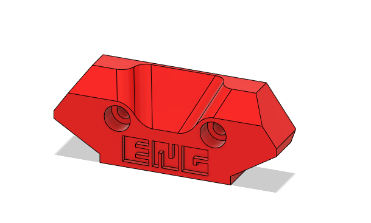

#### P2 - ENG-XCE

X carriage - extruder plate

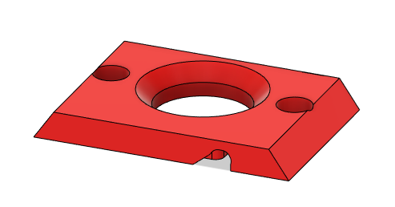

#### P3 - ENG-BEX

Bowden extruder plate - Nema17 mount

## H - Printed Parts with Heat Inserts/Microswitches

This section lists printed parts that require an initial preparation, such as adding heat inserts or installing microswitches.

#### H1 - ENG-XCF

X carriage - hotend + fan mount

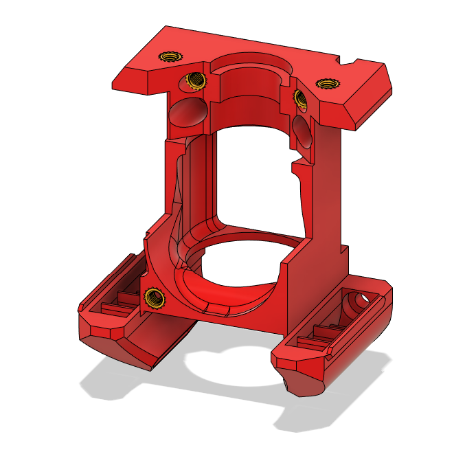

This part uses 5 standard M3 heat inserts, all visible in the figure above.

#### H2 - ENG-XCH

X carriage - hotend mount 2

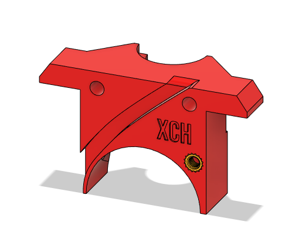

This part uses 1 standard M3 heat insert

#### H3 - ENG-KPL

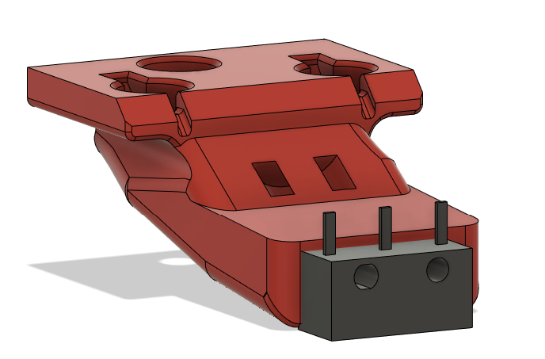

This part has 1 microswitch D2F-L that serves as a Z endstop. Use 2 M2x8

The installation of Klicky also requires 8 6x3mm magnets. See linked instructions on [G1.6](#g16---klicky) 

## G - Guide

This part of guide has multiple sub-steps. In each step, I will show the result, and then proceed to the sub-steps.

#### G1 - Hotend

#### G1.1 - Attach ENG-XCF to X carriage

Use 4 M3x10

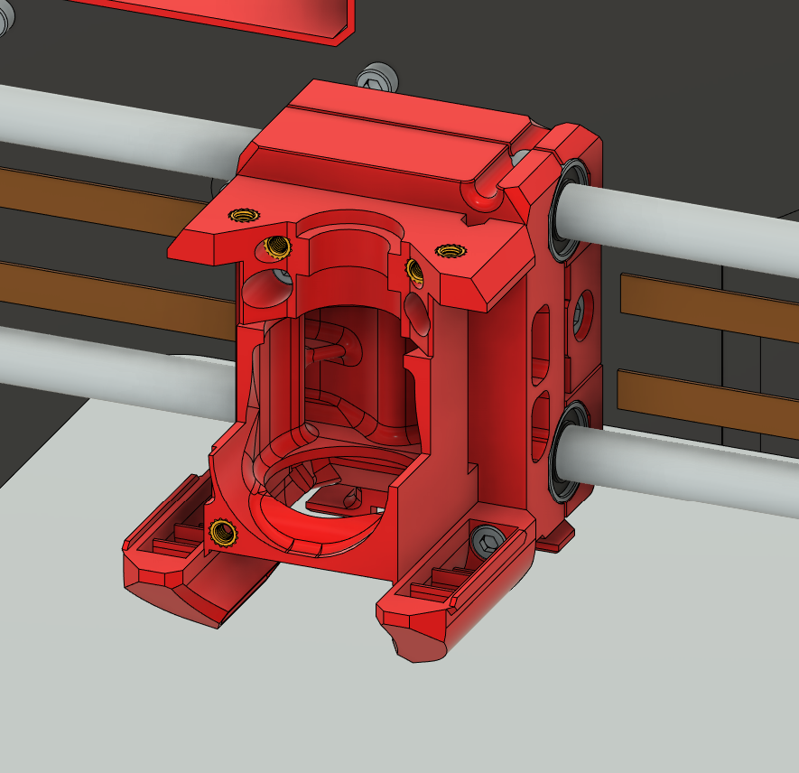

#### G1.2 - Add V6 hotend and hold it in place with ENG-XCH

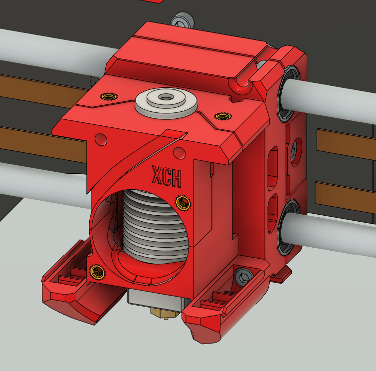

#### G1.3 - Add fans

- Use 3010 fan for the hotend and 4010 blower fans for parts cooling.
- Use 2 M3x12 to attach 3010 to hotend mount 

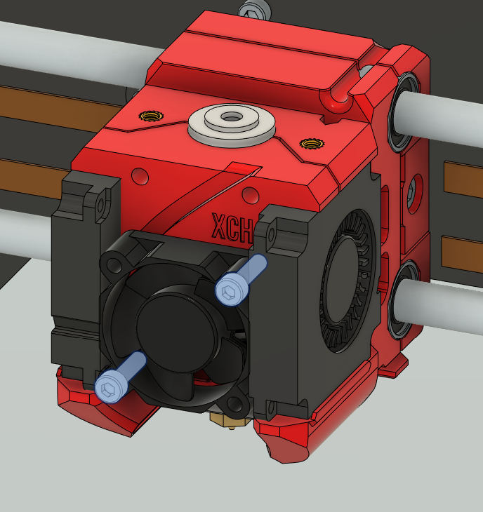

#### G1.4 - Attach ENG-ENG

Use 2 M3x30

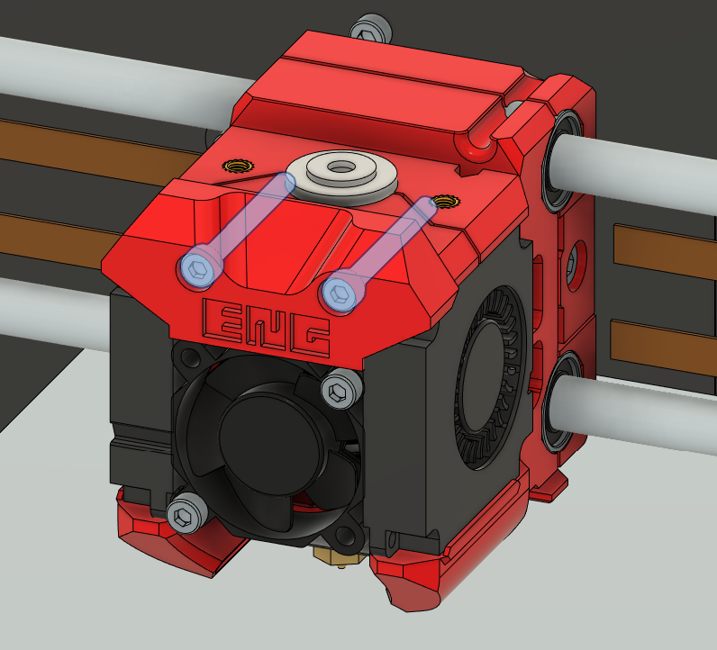

#### G1.5 - Attach ENG-XCE

Use 2 M3x6

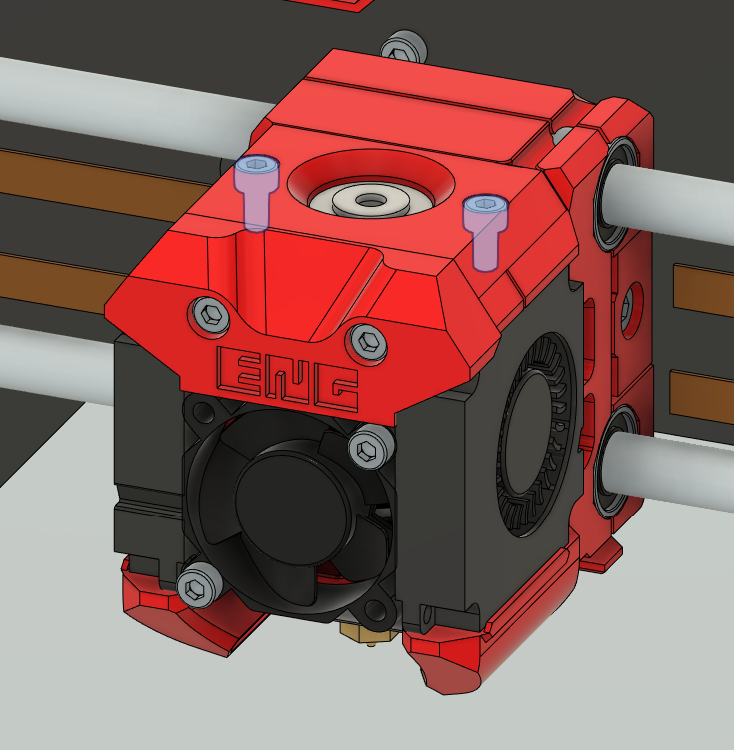

#### G1.6 - Klicky

I have never installed Klicky before. Try to follow the instructions here: https://github.com/jlas1/Klicky-Probe

(Thanks @ItsSunnyB and @OPOP on discord)

#### G2 - Attach Extruder to the back frame using ENG-BEX

Use 2 M4 T-nut and 2 M4x8 to attach ENG-BEX to the backplate. Also use Ender 3 extruder with its screws and Nema 17 to ENG-BEX

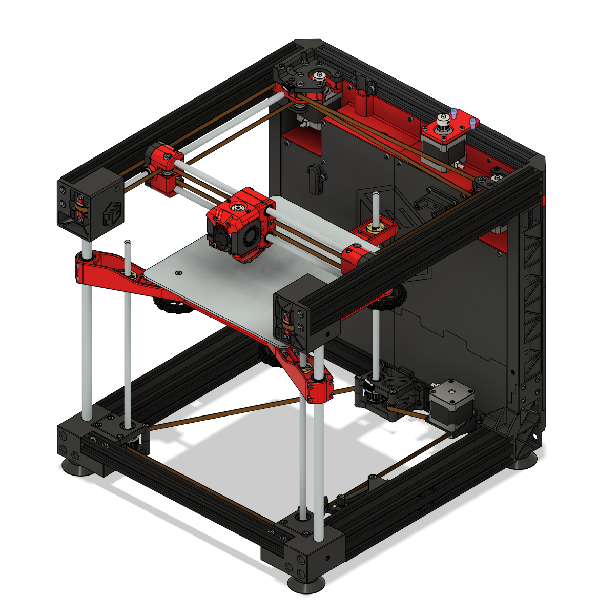
